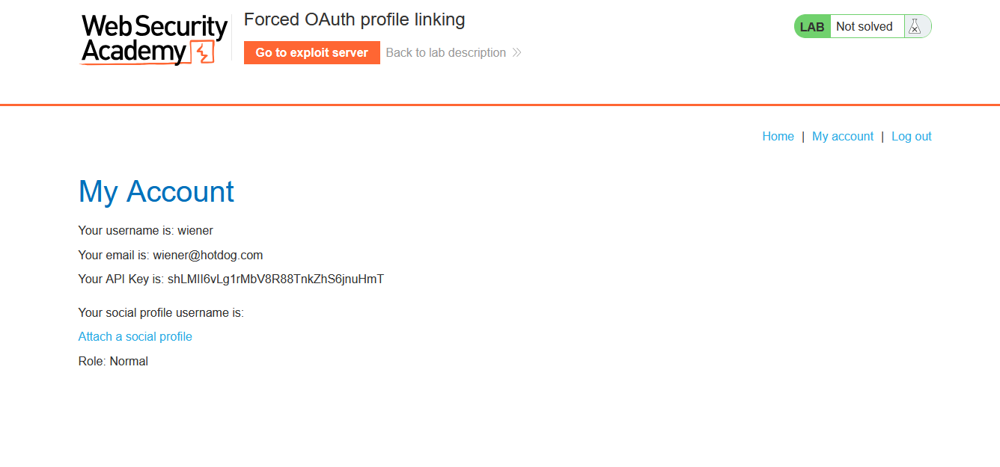
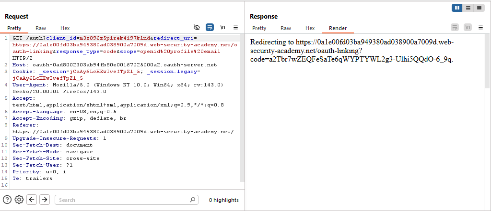
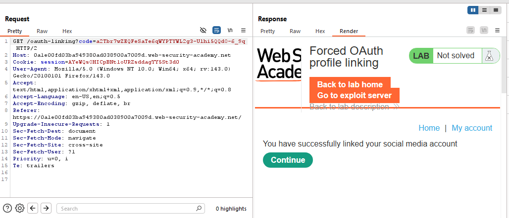
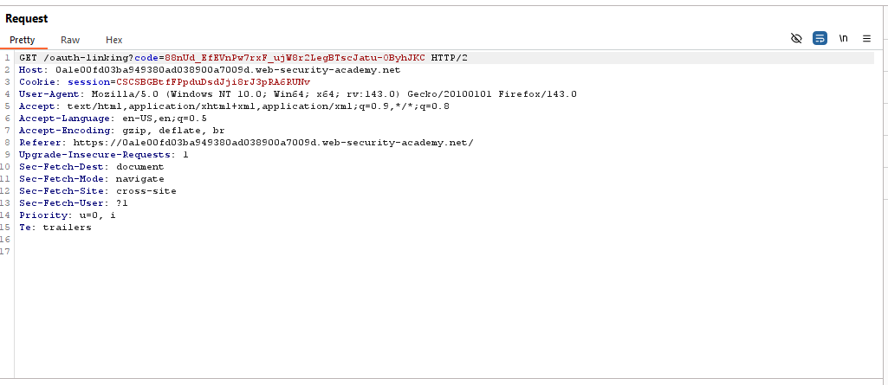
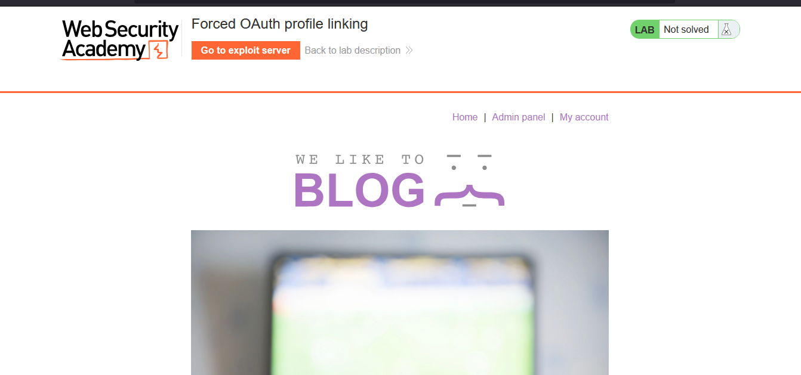
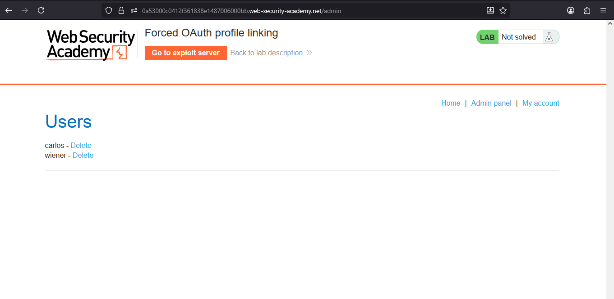
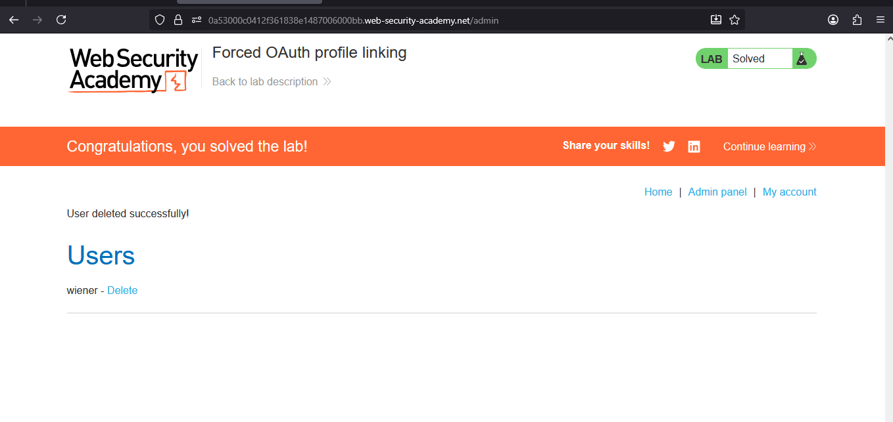

# Lab: Forced OAuth profile linking

> Lab Objective: use a CSRF attack to attach your own social media profile to the admin user's account on the blog website, then access the admin panel and delete `carlos`.

- Valid credentials:

  - Blog website account: `wiener:peter`
  - Social media profile: `peter.wiener:hotdog`

- Login using normal credentials `wiener:peter`.

- Notice that you've the choice to attach a social profile.
  

- Attach a social profile, then inspect the requests made.
  
  

- Notice that the authorization request doesn't include a `state` parameter, therefore it might be vulnerable to CSRF Vulnerability.

- Note that when you logout from your account then choose to `Login with social media`, you're immediately logged in without any form of authentication.

- Therefore, repeat the attach a social profile, and intercept the requests made.

- Intercept the request made to `/oauth-linking`, then Right Click on the request > copy url.
  

```plaintext
https://0a1e00fd03ba949380ad038900a7009d.web-security-academy.net/oauth-linking?code=88nUd_EfEVnPw7rxF_ujW8r2LegBTscJatu-OByhJKC
```

- Then drop the request.

- Then use this payload:

```html
<iframe
  src="https://0a53000c0412f361838e1487006000bb.web-security-academy.net/oauth-linking?code=YAUApmNIydT0c8kbfQBrHPHq3WSHJevhlQWptosBpfa"
></iframe>
```

- And deliver it to victim via exploit server.

- Wait a few seconds, then logout, and login with social media, and you'll notice that you've access to the admin panel.
  

- Access the Admin Panel.
  

- Then delete the user carlos, and the lab is solved.
  

---
