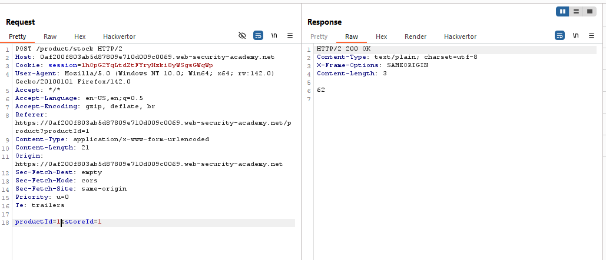
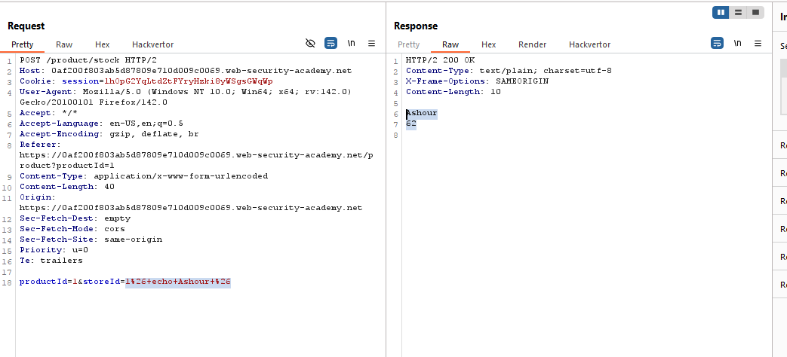
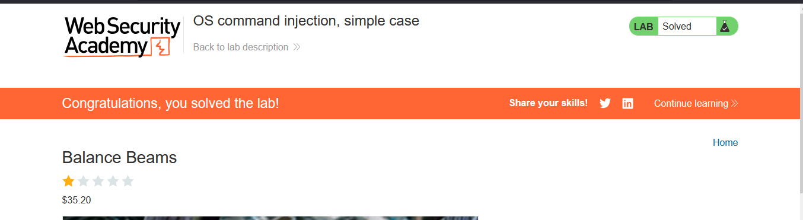

# OS command injection, simple case

> Lab Objective execute the whoami command to determine the name of the current user.

- Check stock for any product, then inspect the request.
  

- Try to inject this command `1& echo Ashour &` in `storeId` parameter, you'll notice that the value `Ashour` is echoed in the response.
  

- Try using a more useful command like `1& whoami &` in `storeId` parameter again.

- You'll notice that it's reflected in the response:
  

- And the lab is solved:
  

---
