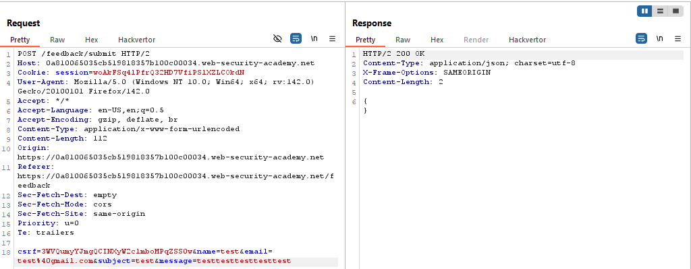
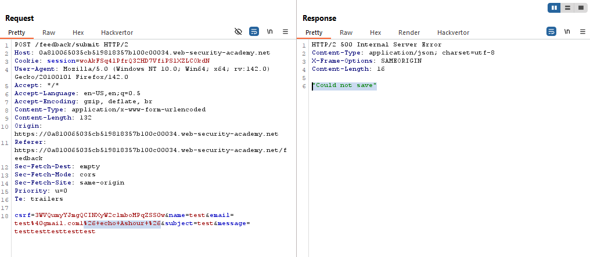
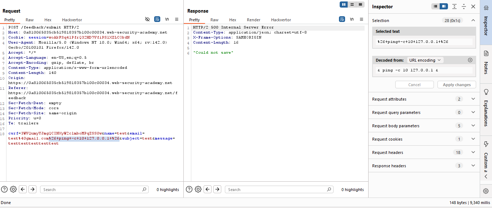

# Blind OS command injection with time delays

> Lab Objective: exploit the blind OS command injection vulnerability to cause a 10 second delay.

- Submit a Feedback, then inspect the request.
  

- Try injecting `1& echo Ashour &`, to try to identify OS Command Injection.

- But injecting this command in all Parameters returns the same response as normal request, except for `email` parameter, which returns `"Could not save"` in the response.
  

- Therefore, I'll try to inject `& ping -c 10 127.0.0.1 &` in the `email` parameter, which will cause a time delay.
  

- You'll notice that a Time Delay has been triggered to nearly 9 sec.

- And the lab is solved.
  

---
