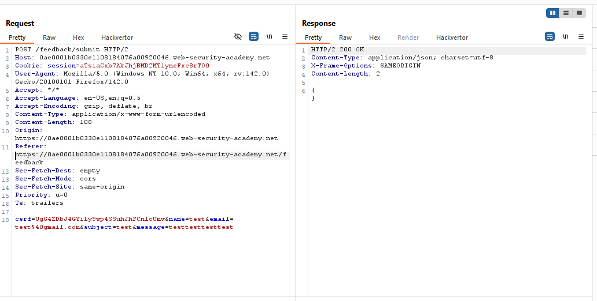
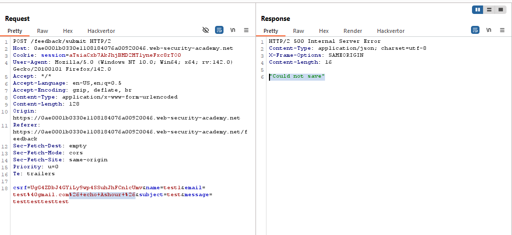
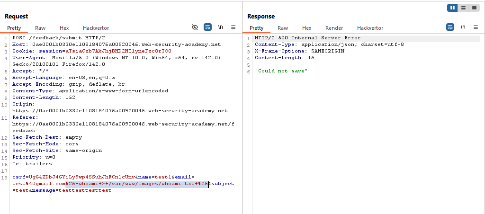
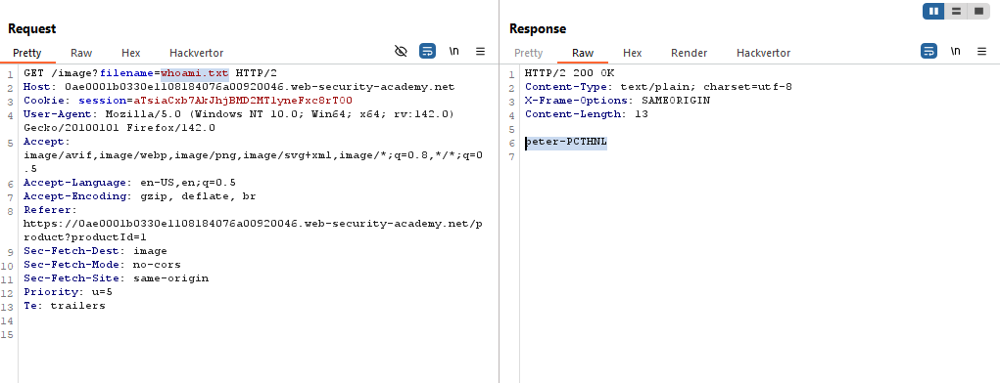
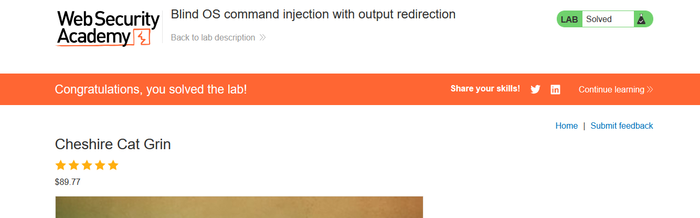

# Blind OS command injection with output redirection

> Lab Objective: execute the whoami command and retrieve the output.

- Submit a Feedback, then inspect the request.
  

- Inject this command `1& echo Ashour &` into all parameters and you'll notice that they return the same response as normal request, but when injecting into `email` parameter, it returns `"Could not save"`
  

- Therefore, try to inject this command into `email` parameter `& whoami > /var/www/images/whoami.txt &`, which will redirect the output of `whoami` command to this file `/var/www/images/whoami.txt`.
  

- Then load any Photo, then intercept the request that retrieves the image from the server and change the `filename` parameter to `whoami.txt` (which holds the value of `whoami` command).

- The value of `whoami` command is retrieved in the response.
  

- And the lab is solved.
  

---
