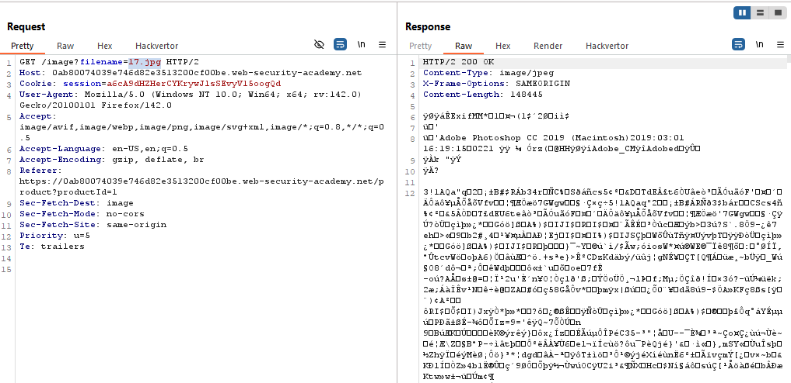
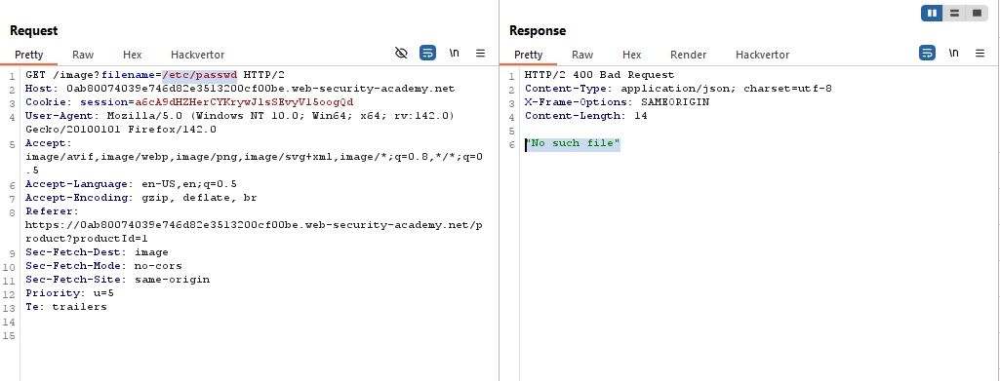
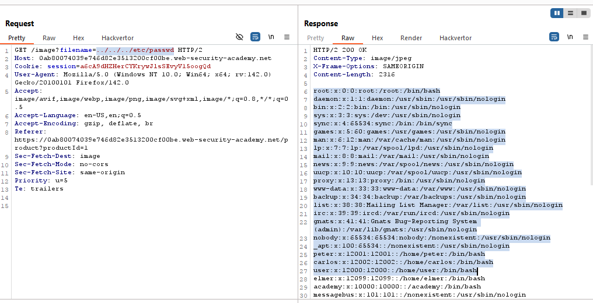

# Lab: File path traversal, simple case

> Lab Objective: retrieve the contents of the `/etc/passwd` file.

- View Details of any product and inspect requests made.

- You'll notice that there is a request which retrieves the image of the required product.
  

- Attempting to read content of `/etc/passwd` file, but it results in `"No such file"`.
  

- Therefore, I'll try to use `../` which will exit the current directory and goes one directory up in filesystem structure.

- I'll start by placing one `../` until I get to access root directory and be able to access `/etc/passwd` file.

- After attempting 3 times, I was able to access `/etc/passwd` file using this payload `../../../etc/passwd`.
  

- And the lab is solved.
  

---
