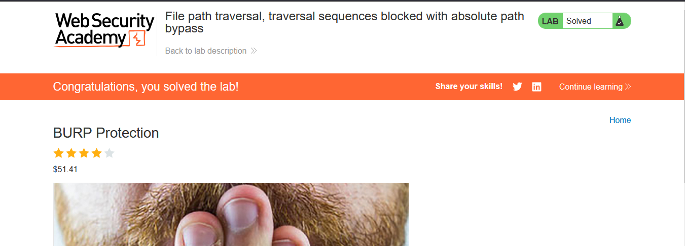

# Lab: File path traversal, traversal sequences blocked with absolute path bypass

> Lab Objective: retrieve the contents of the `/etc/passwd` file.

- View Details of any Products, then Inspect the requests made.

- You'll notice that the Application make a request to retrieve the image of the specified product.
  

- Trying to directly retrieve content of `/etc/passwd` file using this absolute path, was successful.
  

- Therefore, you was able to read contents of `/etc/passwd` file, and the lab is solved.
  

---
