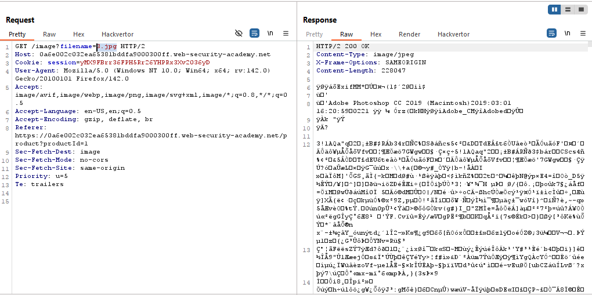

# Lab: File path traversal, traversal sequences stripped non-recursively

> Lab Objective: retrieve the contents of the `/etc/passwd` file.

- View details of any product, then inspect the requests made.

- You'll notice that the Application make a request to retrieve the image of the specified product.
  

- Trying to directly retrieve contents of `/etc/passwd` file using it's absolute path wasn't successful.
  

- Trying to use `../` to get to root directory then access `/etc/passwd` file also gave `"No such file"`
  

- But when using this technique `....//` which after stripping `../` by the application our payload will be left with `../` (our objective).

- Therefore using this payload `....//....//....//etc/passwd` let me retrieve contents of `/etc/passwd` file successfully, because after stripping `../` our payload will be `../../../etc/passwd`.
  

- And the lab is solved.
  

---
