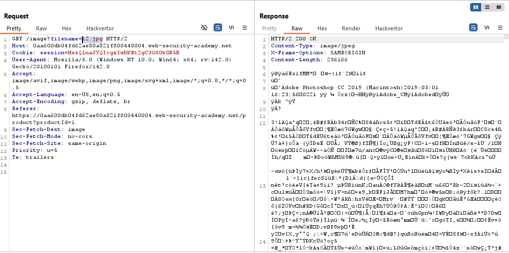
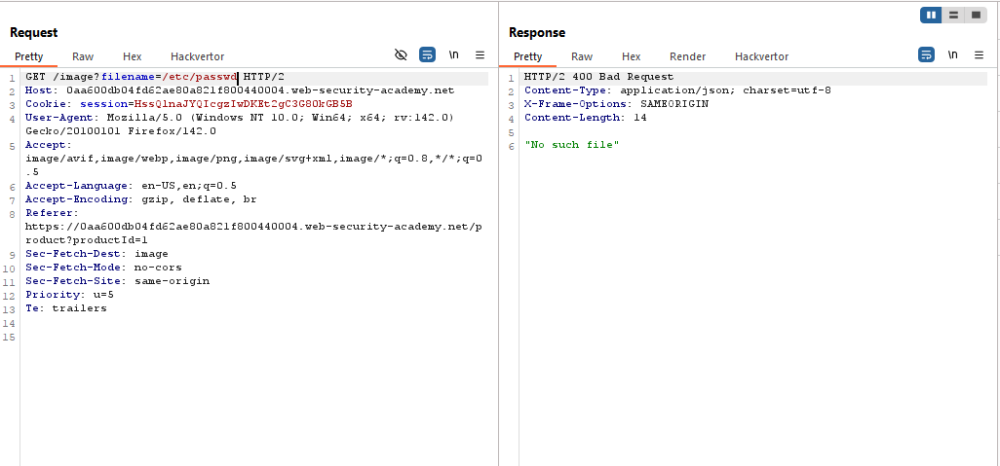
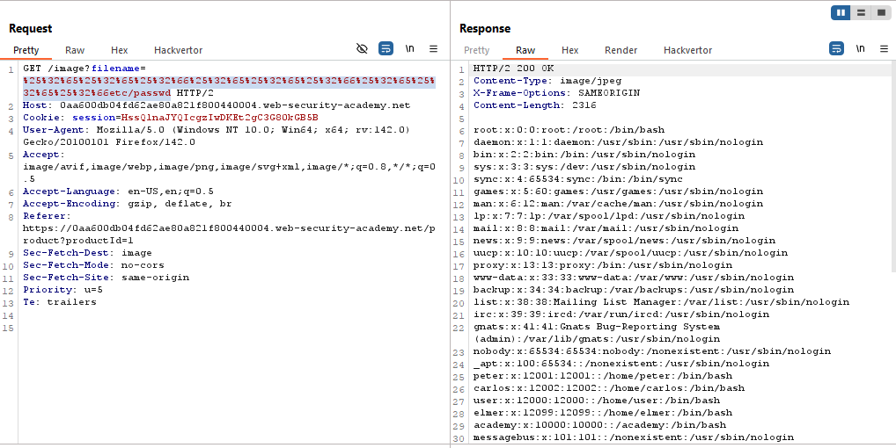
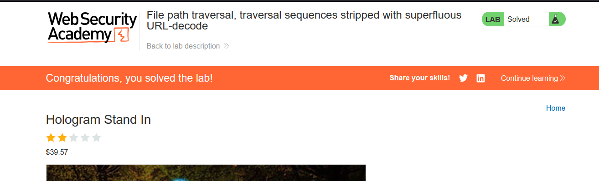

# Lab: File path traversal, traversal sequences stripped with superfluous URL-decode

> Lab Objective: retrieve the contents of the `/etc/passwd` file.

- View details for any product then inspect requests made.

- You'll notice that the application made an request to retrieve the image of the specific product.
  

- While trying the following payloads, It gave the same result `"No such file"`.

```
/etc/passwd
../../../../../etc/passwd
....//....//....//....//....//etc/passwd
```



- But when trying this payload `../../../../../etc/passwd` but with double url-encoding it, I was able to retrieve contents of `/etc/passwd` file.
  

- And the lab was solved.
  

---
