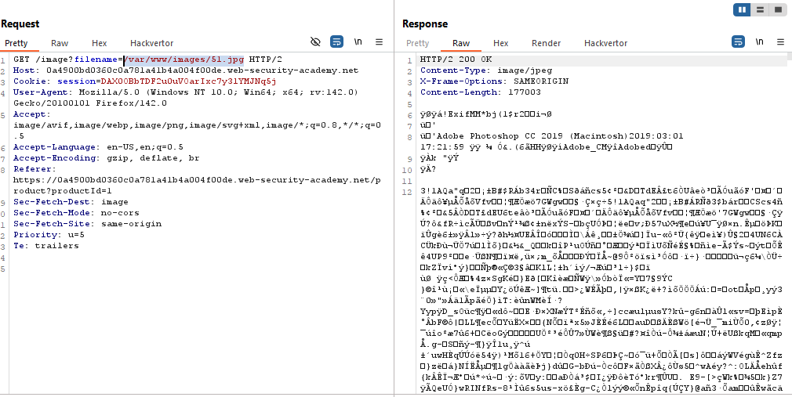
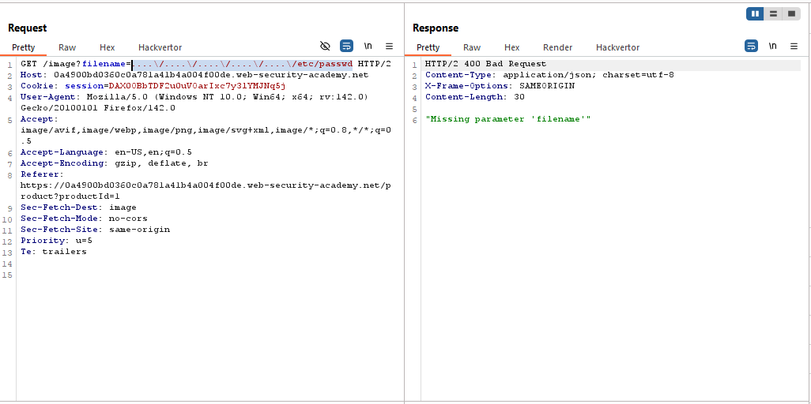
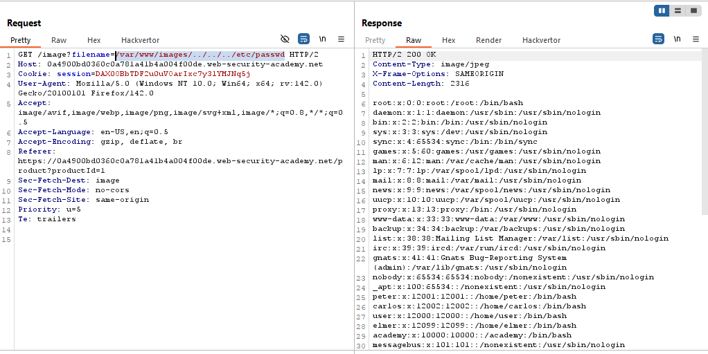

# Lab: File path traversal, validation of start of path

> Lab Objective: retrieve the contents of the `/etc/passwd` file.

- View Details of any products, then inspect the requests made.

- You'll notice that the application made a request to retrieve the image of the specified product.
  

- While trying all the following payloads, the result with the same `"Missing parameter 'filename'"`.

```
/etc/passwd
../../../../../../../etc/passwd (single & double url-encoded)
....\/....\/....\/....\/....\/etc/passwd (single & double url-encoded)
```



- But when using this payload `/var/www/images/../../../etc/passwd`, I was able to retrieve contents of `/etc/passwd` file, The application only checks if this path `/var/www/images/` exist at the beginning of the specified filename.
  

- And the lab was solved.
  

---
