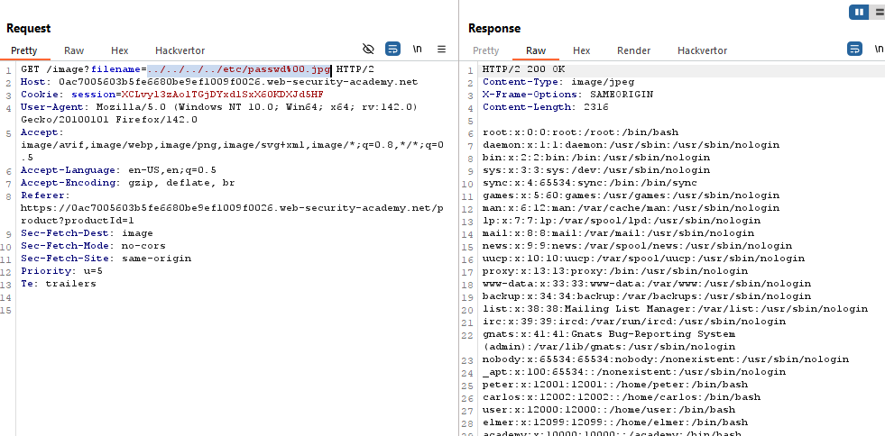

# Lab: File path traversal, validation of file extension with null byte bypass

> Lab Objective: retrieve the contents of the `/etc/passwd` file.

- View details for any product, then inspect requests made.

- You'll notice that the application made a request to retrieve the image for the specified product.
  

- When trying the following payloads, the result was the same `"No such file"`

```
/etc/passwd
../../../../../../etc/passwd
..//..//..//..//..//..//etc/passwd
```


- But when using this payload `../../../../etc/passwd%00.jpg`, I was able to retrieve contents of `/etc/passwd` file.
  

- And the lab is solved.
  

---
