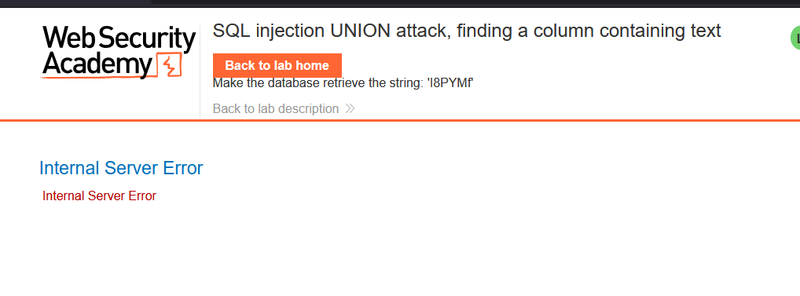
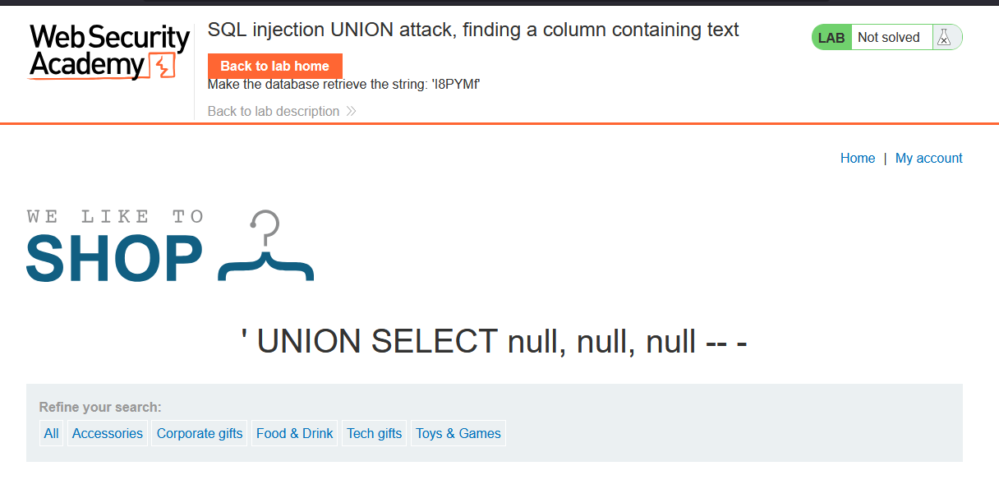
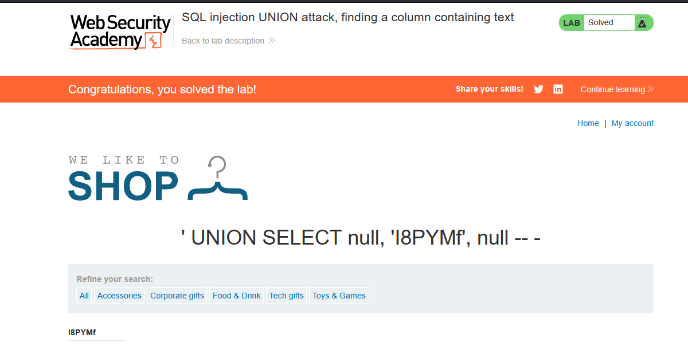

# Lab: SQL injection UNION attack, finding a column containing text

> Lab Objective: perform a SQL injection UNION attack that returns an additional row containing the value provided.

- Firstly, Filter Products based on Categories (e.g., `?category=Accessories`)

- Use this payload to see if SQLi exist `Accessories'`.
  

  - Which indicates that SQLi exist

- Use this payload `' UNION SELECT null, ... -- -`, increase the number of nulls to see how many columns are returned by the main query.

- You'll configure that the main query return three columns using this payload `' UNION SELECT null, null, null -- -`
  

- Replace each null with `'provided_value'` to see which column carry a string value and show the provided value to solve the lab.

- This is the payload needed to solve the lab `' UNION SELECT null, 'I8PYMf', null -- -`
  
