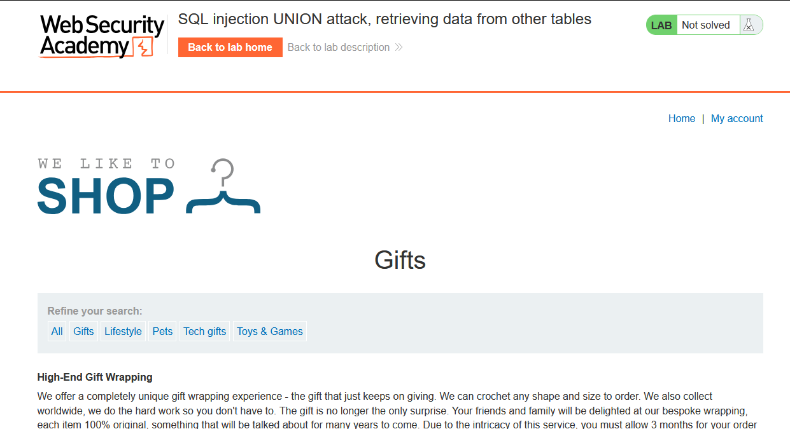
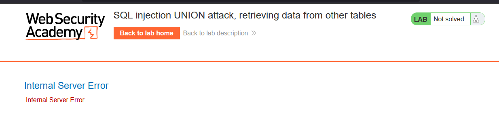
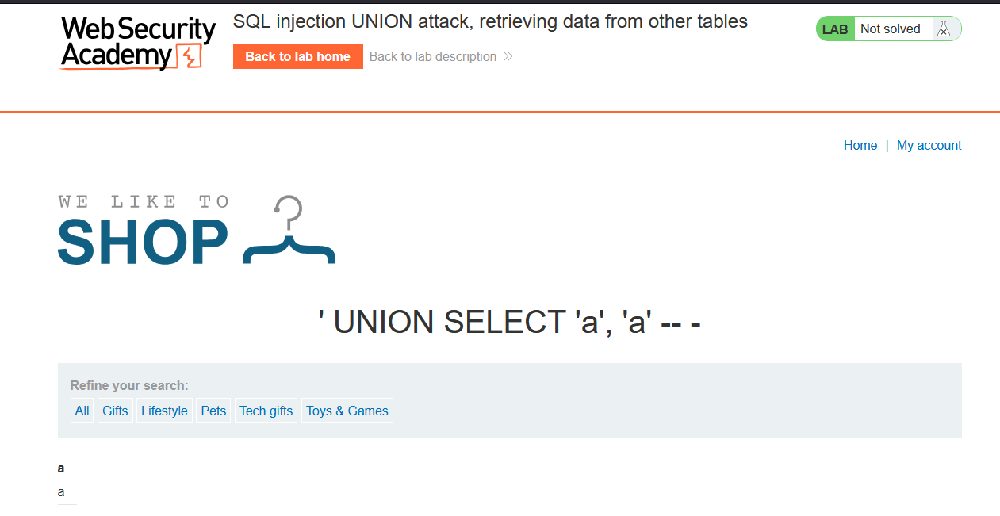
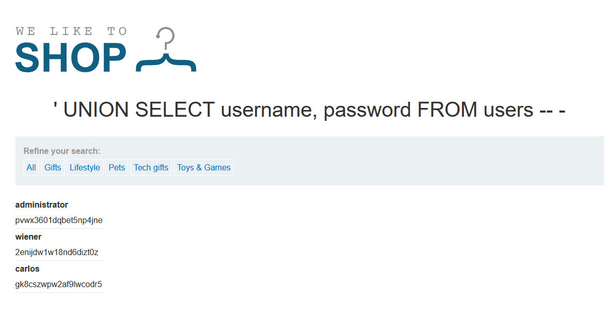
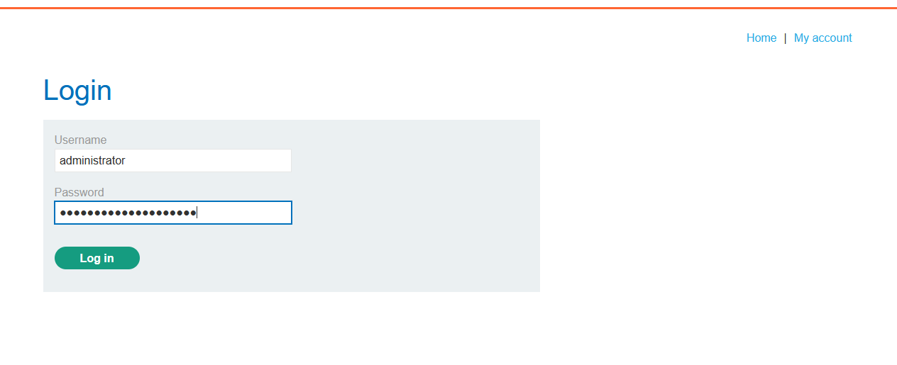
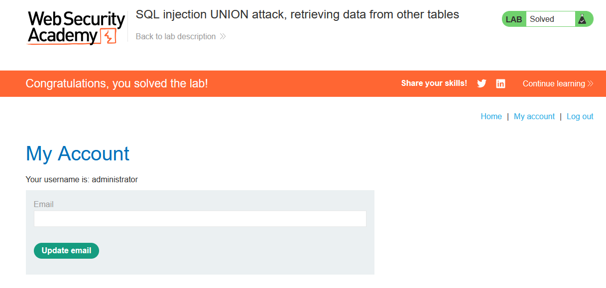

# Lab: SQL injection UNION attack, retrieving data from other tables

> Lab Objective: perform a SQL injection UNION attack that retrieves all usernames and passwords, and use the information to log in as the administrator user.

- Firstly, Filter Products based on category (e.g., `?category=Gifts`)
  

- Use this payload to check if SQLi exist `Gifts'`
  

  - Which indicates that SQLi exist.

- Use `'UNION SELECT null, ... -- -` to check how many columns are returned by the main query, then substitute null with `'a'` to see which columns carry a string value.

- The main query returns two columns and both can carry a string value, using this payload `' UNION SELECT 'a', 'a' -- -`.
  

- Use this payload `' UNION SELECT username, password FROM users -- -`, to retrieve all usernames and passwords from users table.

  > Note: table & column names are provided in the lab description

  

- Use the administrator credentials to log in as administrator.
  
  
