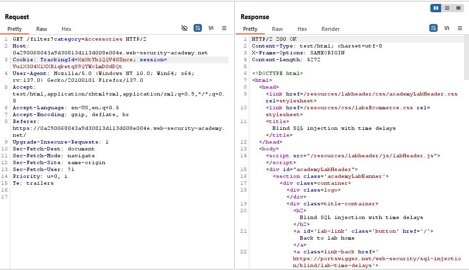
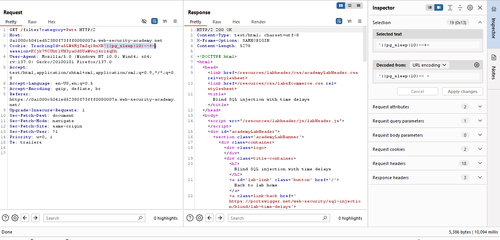
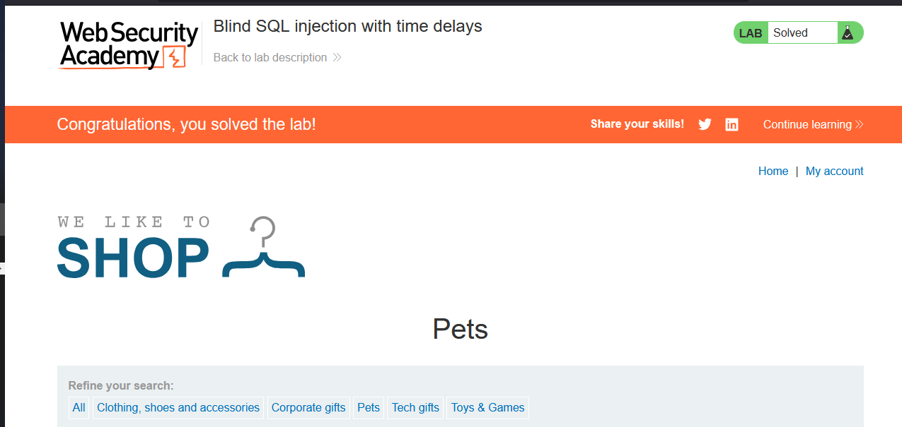

# Lab: Blind SQL injection with time delays

> Lab Objective: exploit the SQL injection vulnerability to cause a 10 second delay.

- Firstly, run the Burp with interception off (we'll look the history in a while), then filter products based on category.

- Look at that request in the burp, send to repeater, you'll see that there is a tracking id in the cookie
  

- Then try to concat time delays payloads of different DBMSs, this is the only one that will work

  - The Payload: `'||pg_sleep(10)--+-`
    

- Therefore the lab is solved.
  
