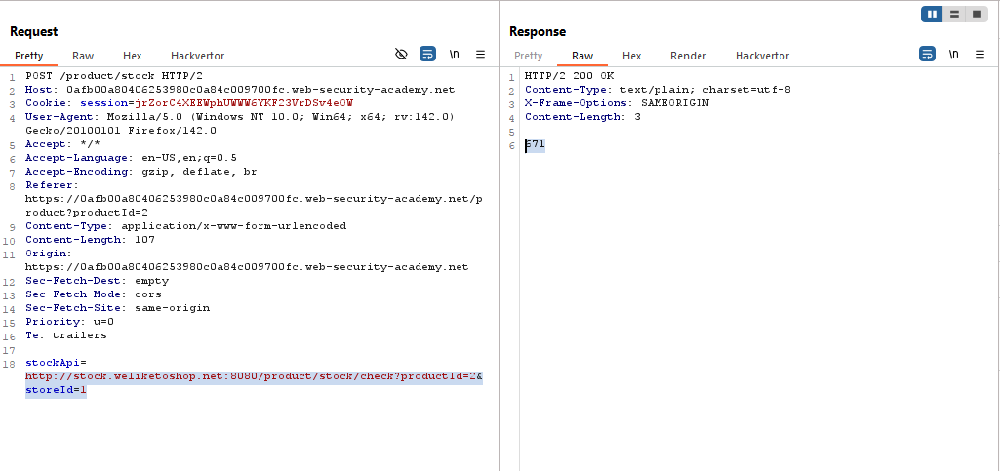
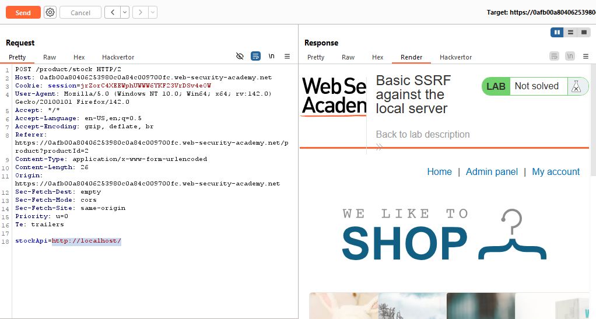
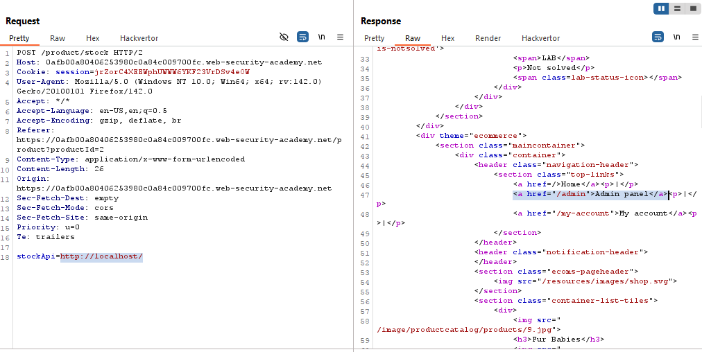
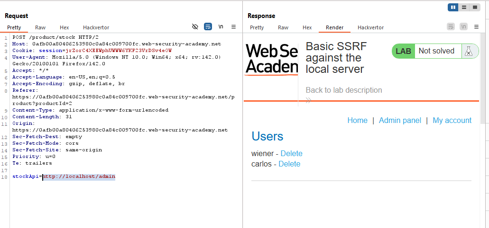
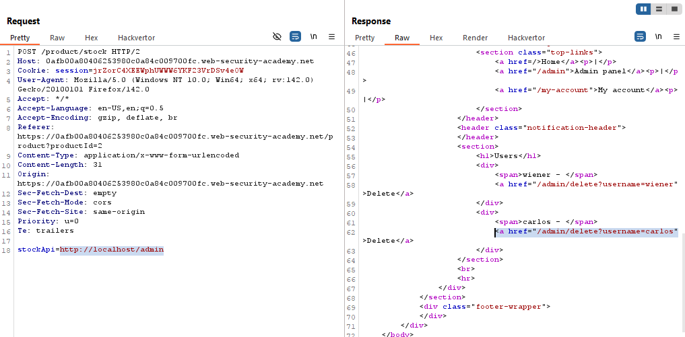
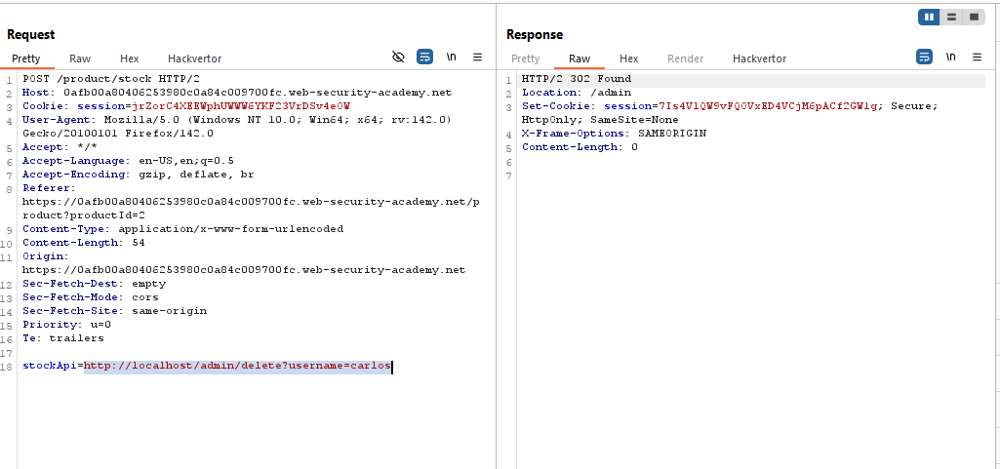
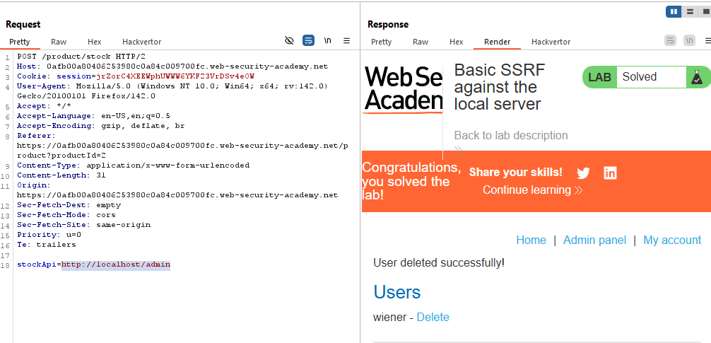
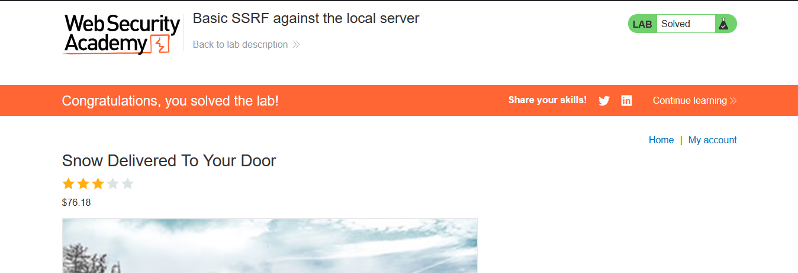

# Lab: Basic SSRF against the local server

> Lab Objective: change the stock check URL to access the admin interface at http://localhost/admin and delete the user carlos.

- Check Stock for any product, then inspect the request sent.

- You'll notice that the request passes an URL to the server which is used to retrieve the Stock number for specified product.
  

- Change the value of `stockApi` to `http://localhost`, you'll notice that the response contain the Home Page with an Admin Panel Path.
  
  

- Change the value of `stockApi` to `http://localhost/admin`, you'll notice that you've accessed the Admin Panel, and you can delete existing users through a get request, for instance: `/admin/delete?username=carlos`
  
  

- The Lab Objective is to delete the user carlos, therefore change the stockApi value to `http://localhost/admin/delete?username=carlos`.

- The user was deleted successfully.
  
  

- the lab is solved successfully.
  

---
