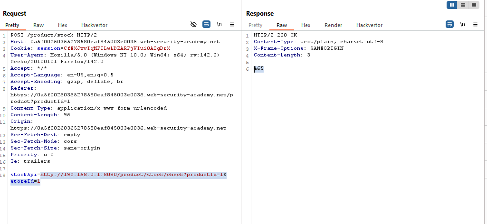
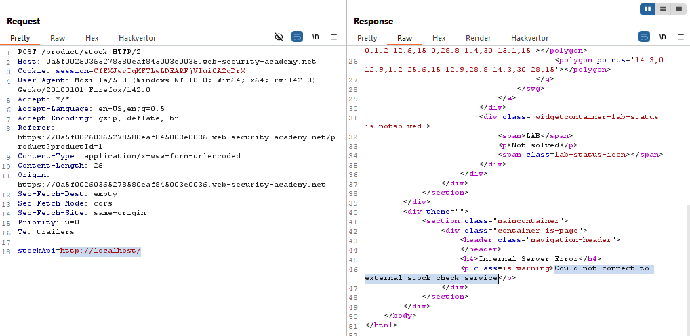
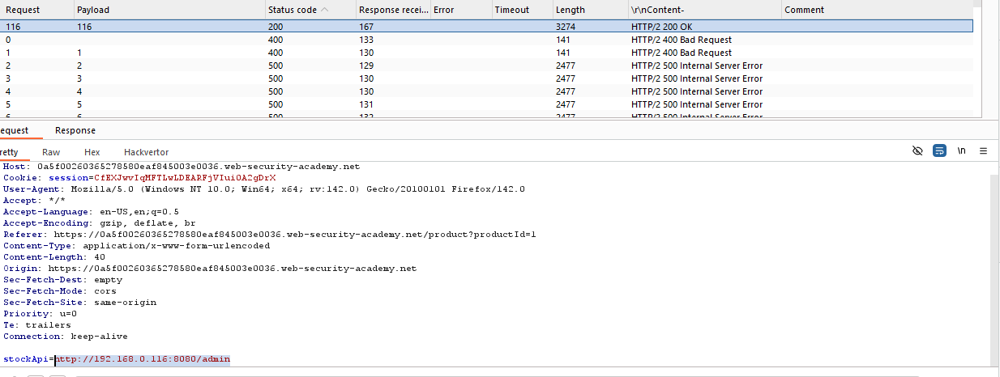
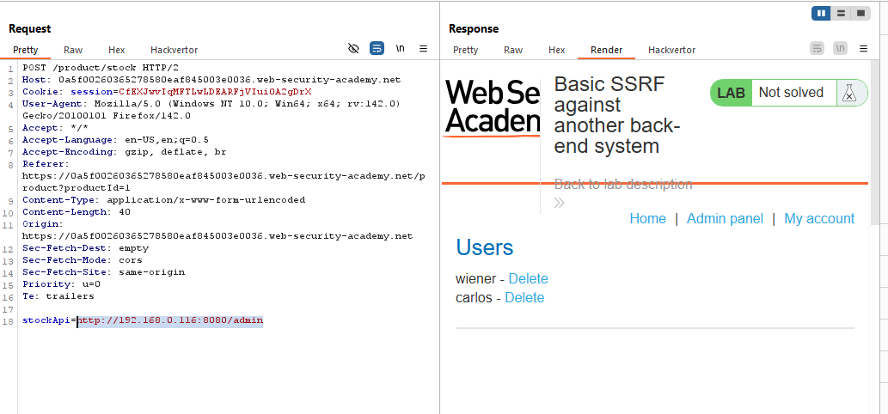
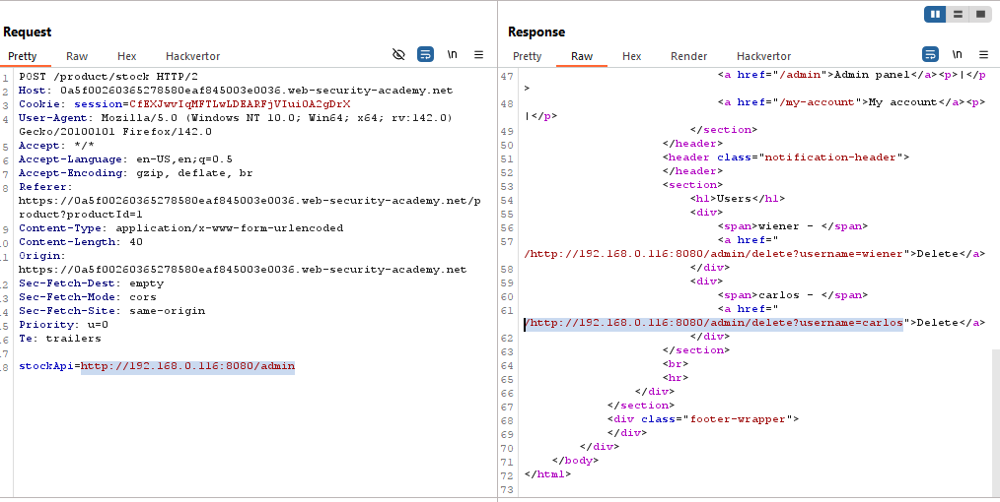
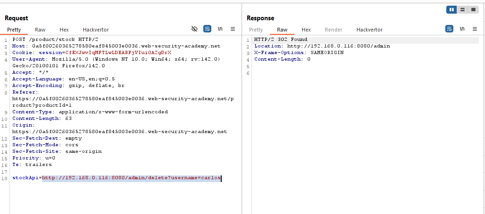
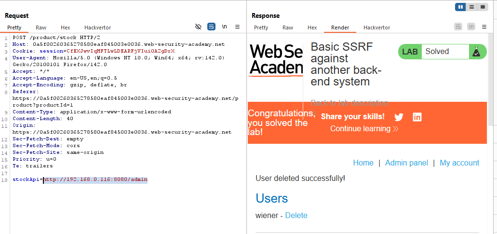
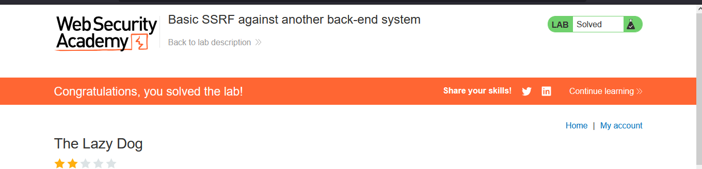

# Lab: Basic SSRF against another back-end system

> Lab Objective: use the stock check functionality to scan the internal 192.168.0.X range for an admin interface on port 8080, then use it to delete the user carlos.

- Check stock for any product and inspect the request.

- You'll notice that the POST body contains a URL that is used to retrieve the Stock Number for the specified product.
  

- Change the value of `stockApi` to `http://localhost/`, then inspect the response.

- You'll notice that you couldn't connect to external stock check service.
  

- I'll try to find the admin panel through brute forcing on the last quarter of this IP `192.168.0.1` and port `8080`, through the intruder. (from 1 to 255), the URL to brute force on `http://192.168.0.x/admin`

- You'll notice that there is a response with `200 OK` status code, the specified url is `http://192.168.0.116:8080/admin`
  

- Therefore, send the check stock request with `http://192.168.0.116:8080/admin` as the value for `stockApi`.

- You'll notice that you've retrieved the admin panel, and was able to delete the user carlos via this get request `http://192.168.0.116:8080/admin/delete?username=carlos`.
  
  

- Replace the value of stockApi with this URL `http://192.168.0.116:8080/admin/delete?username=carlos`, and you'll notice that the user carlos was deleted successfully.
  
  

- And the lab is solved successfully.
  

---
