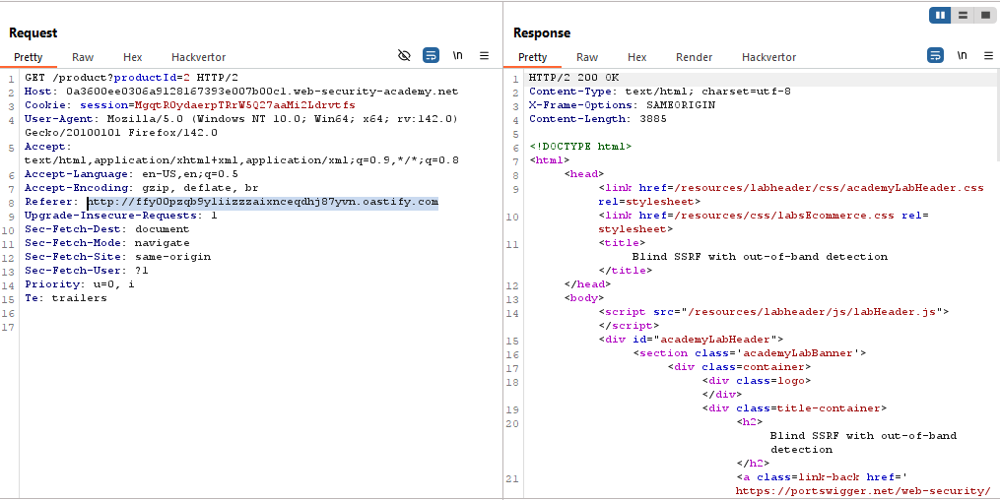
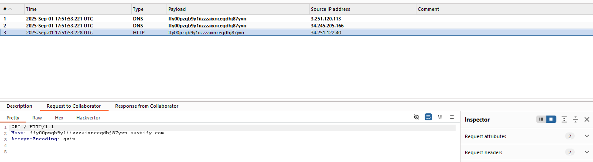
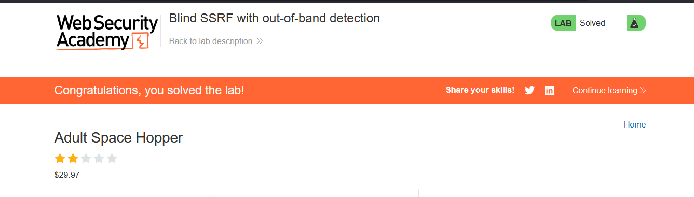

# Lab: Blind SSRF with out-of-band detection

> Lab Objective: use this functionality to cause an HTTP request to the public Burp Collaborator server.

- Load a product page and you'll notice that the application uses analytics software which fetches the URL specified in the `Referer` header when a product page is loaded.

- When you start Burp Collaborator, and set the value of the Referer header to the URL to Burp Collaborator, the application will fetch that URL, and you'll see the DNS and HTTP requests made to Collaborator.
  
  

- Hence the lab is solved successfully.
  

---
