# Lab: SSRF with blacklist-based input filter

> Lab Objective: change the stock check URL to access the admin interface at http://localhost/admin and delete the user carlos.

- Check Stock for any product, and inspect the request.

- You'll notice that the POST request utilizes a URL which is used to fetch the stock number of a specified product.
  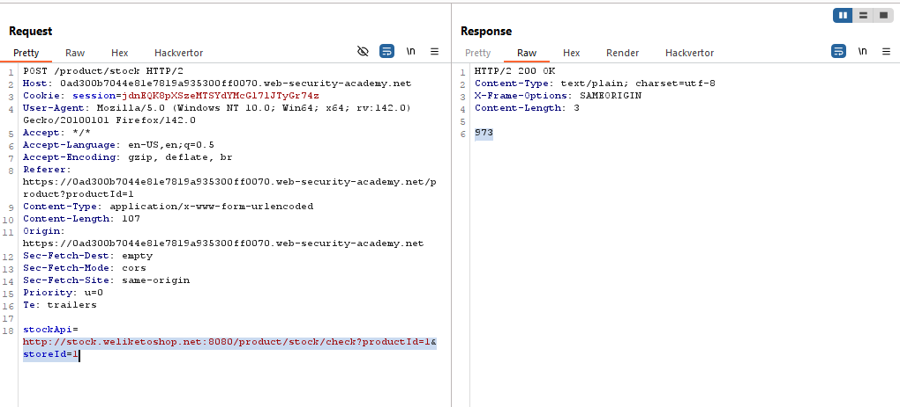

- Set the value of stockApi to `http://localhost/` and `http://127.0.0.1/`, and you'll notice that external requests to check stock is blocked.
  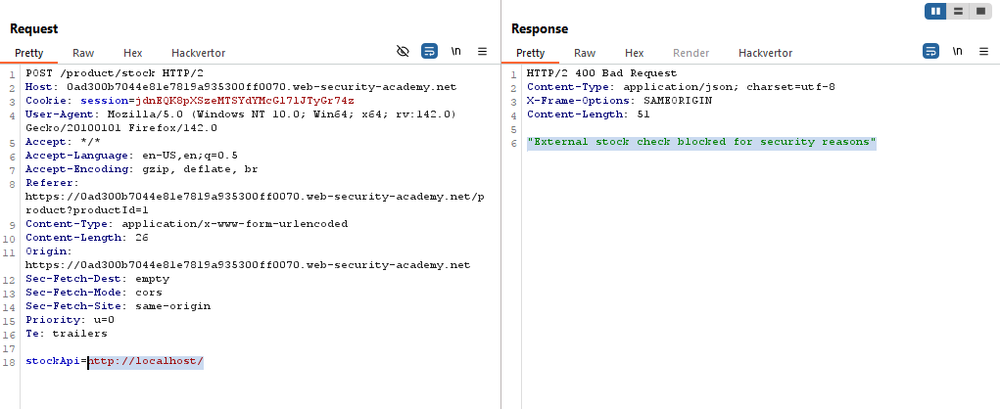
  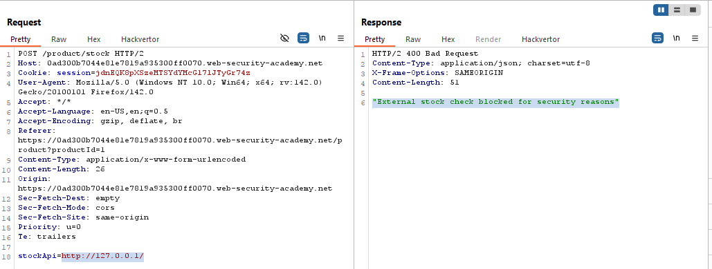

- When using the shorthand for Localhost IP `http://127.1/`, I was able to retrieve the home page which includes the Admin Panel at `/admin`
  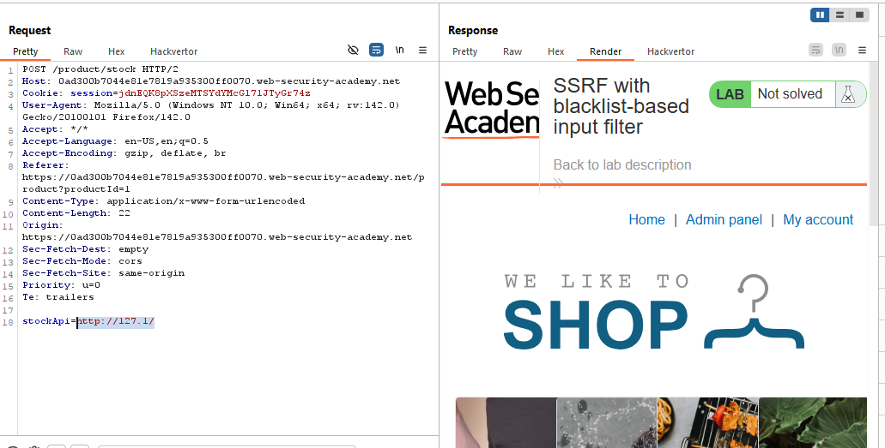
  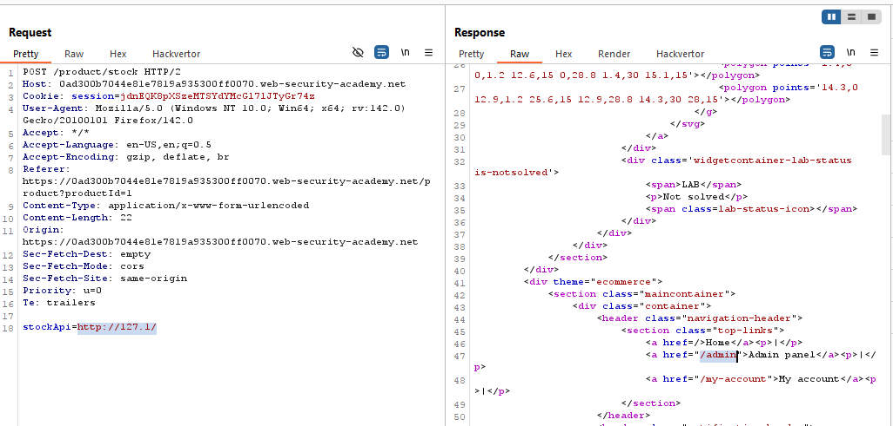

- But when using this path `http://127.1/admin/`, but it was blocked.
  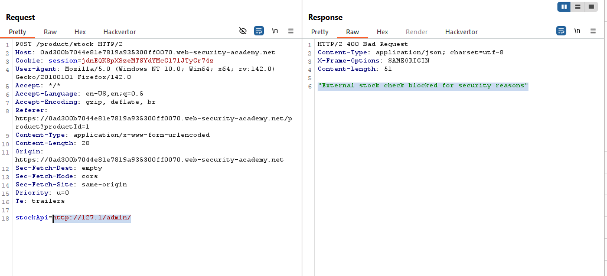

- But when using `http://127.1/AdMiN/` you'll be able to get the Admin Panel and delete the user carlos through this get request `/admin/delete?username=carlos`
  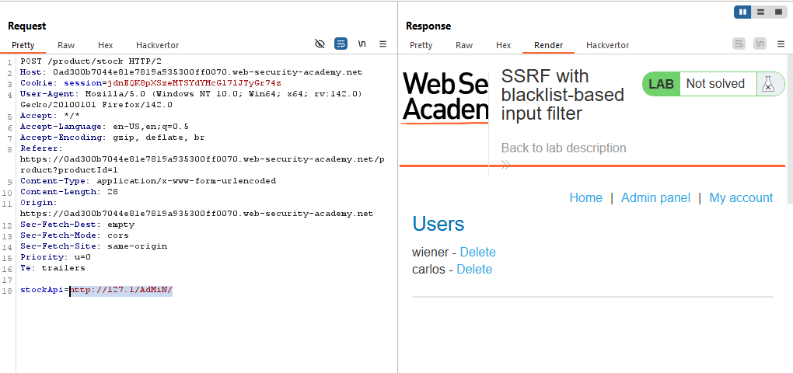
  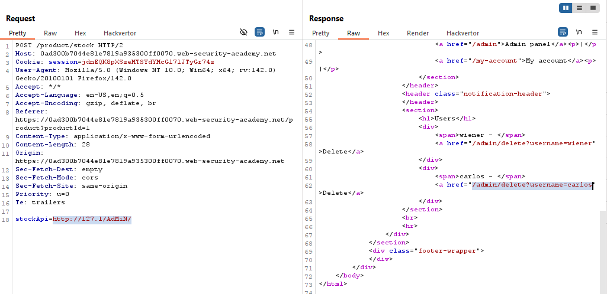

- Set the value of stockApi to `http://127.1/AdMiN/delete?username=carlos`, and the user carlos was deleted successfully.
  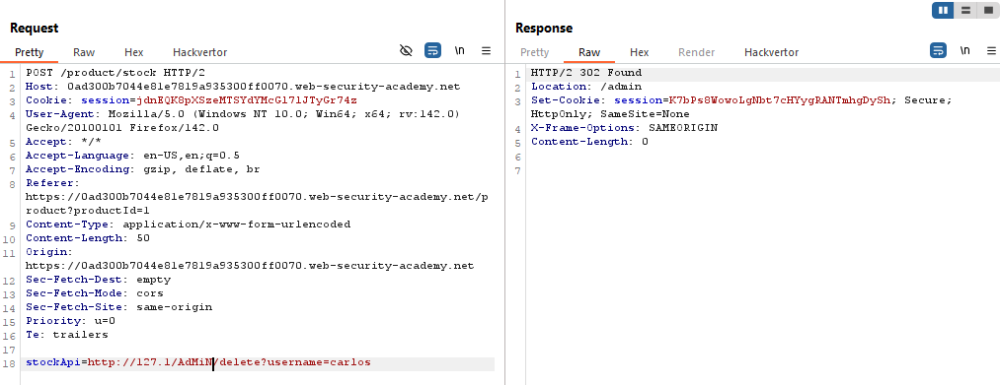
  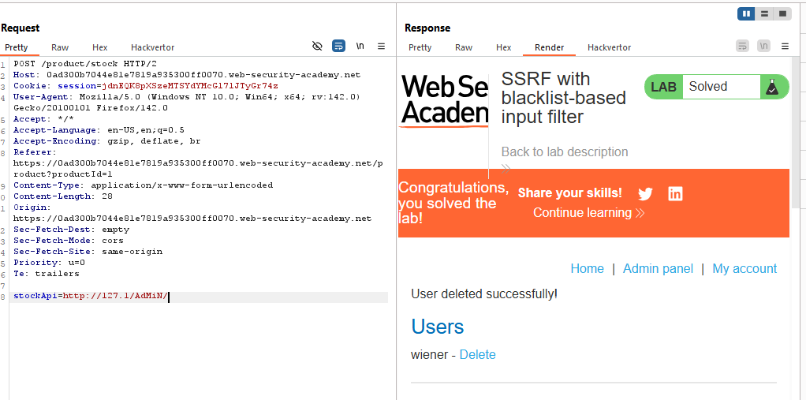

- The Lab is solved successfully.
  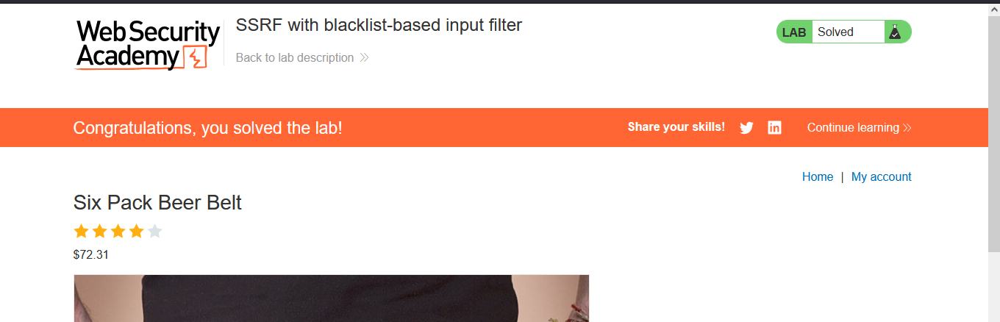

---
