# Lab: Basic server-side template injection (code context)

> Lab Objective: review the Tornado documentation to discover how to execute arbitrary code, then delete the `morale.txt` file from Carlos's home directory.

- Login using provided credentials `wiener:peter`.

- Post a comment in any product page, you'll review your preferred name and the submitted comment.
  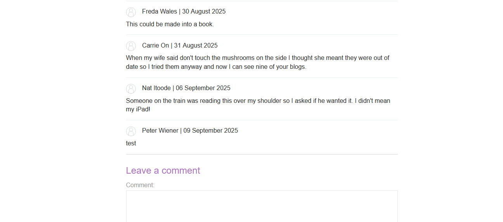

- View `/my-account`, then change the preferred name and inspect the request.

- Add this payload `}}{{7*7` to the value of `blog-post-author-display` parameter.
  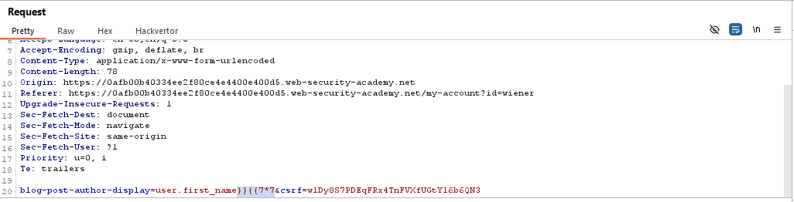

- Review the comment you just submitted, you'll notice that the result `49` is added to your first name.
  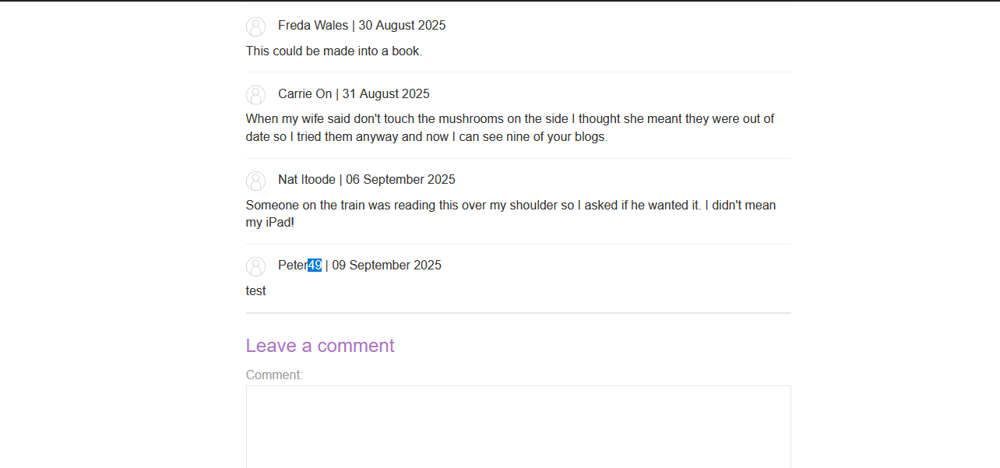

- Intercept the preferred name request again, and replace this payload `''}}{{os.system('whoami')}}` with the value of `blog-post-author-display` parameter.
  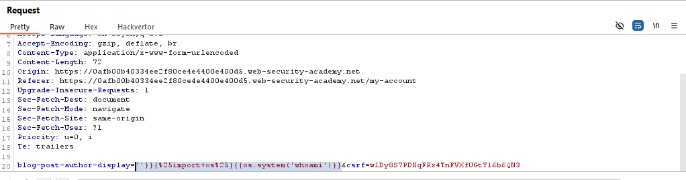

- Then view the submitted comment, you'll notice that the command has executed.
  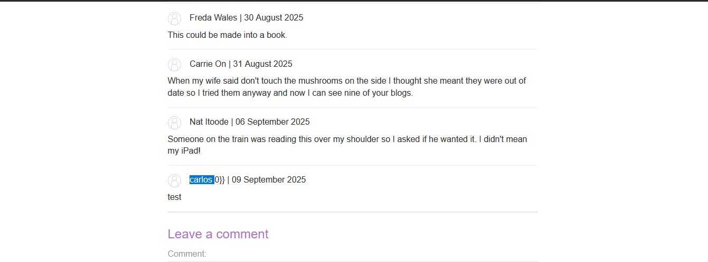

- Repeat the same steps, but for listing directories of root directory `/` using this payload `''}}{{os.system('ls /')}}`
  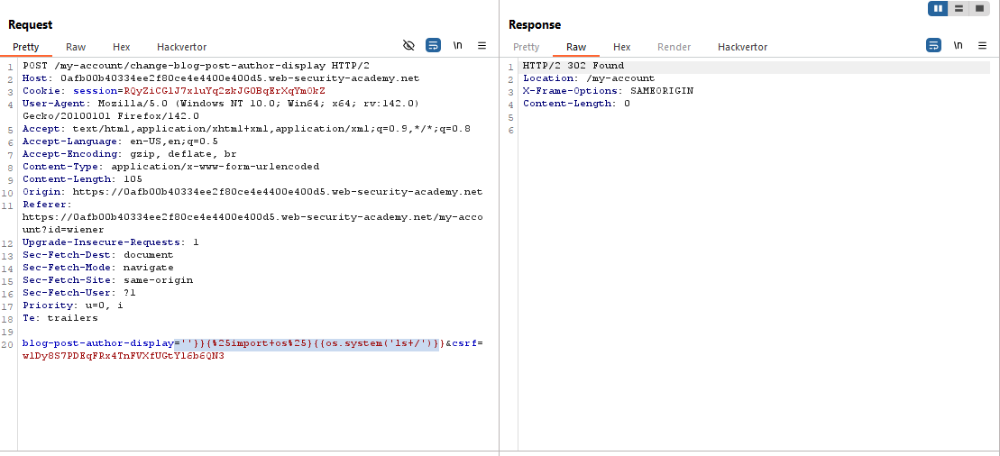
  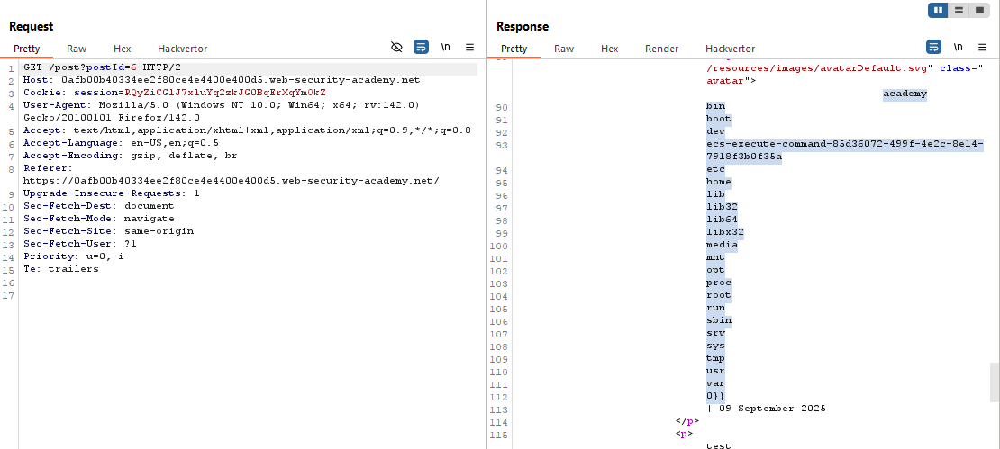

- List `/home/` directory using this payload `''}}{{os.system('ls /home/')}}`
  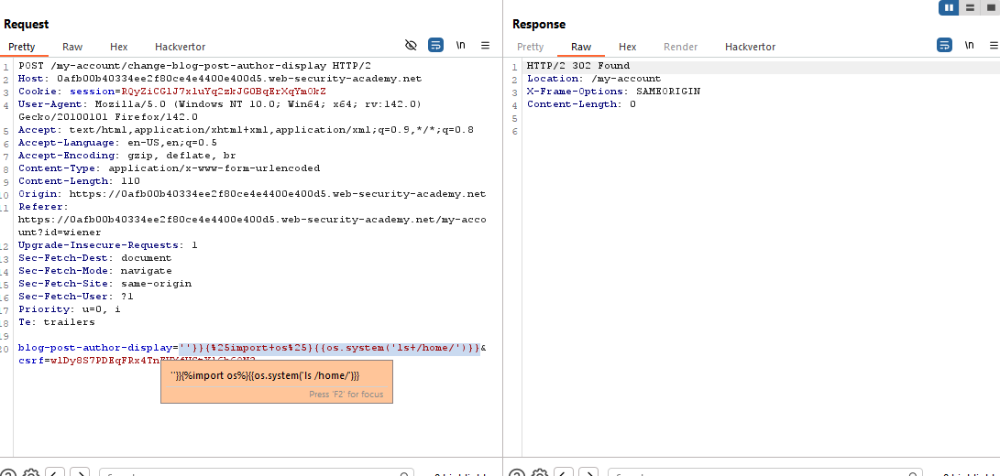
  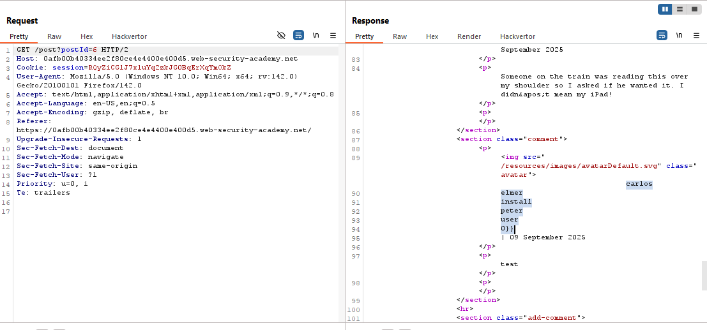

- List `/home/carlos` directory using this payload `''}}{{os.system('ls /home/carlos')}}`
  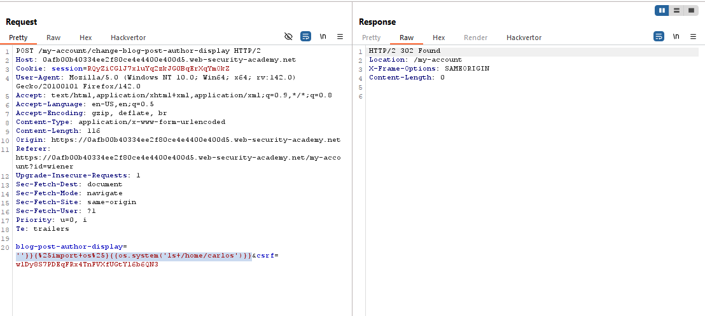
  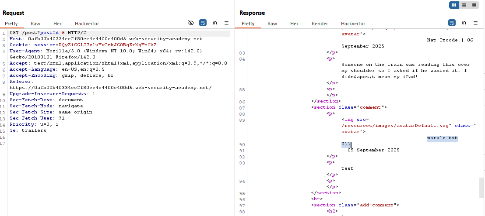

- Then finally, delete `morale.txt` file in carlos home directory using this payload `''}}{{os.system('rm /home/carlos/morale.txt')}}`
  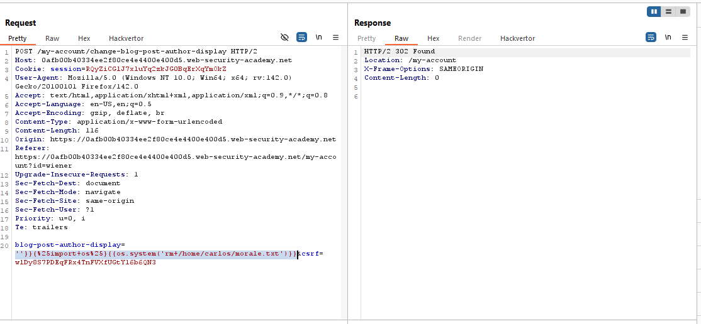
  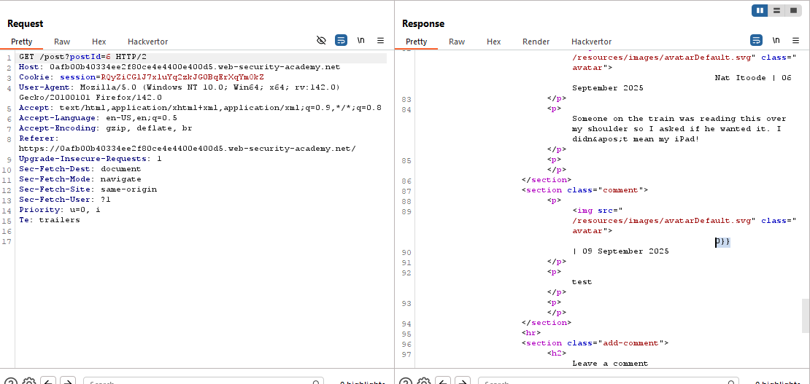

- And the lab is solved.
  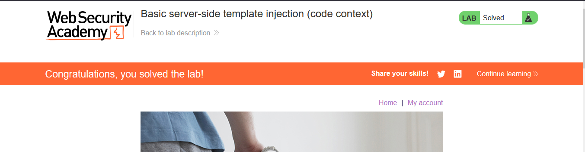

---
