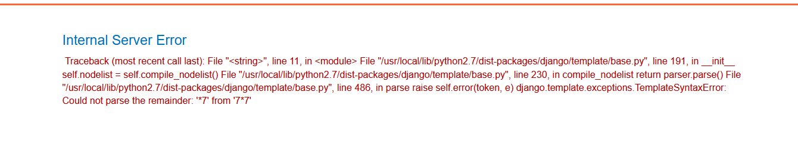
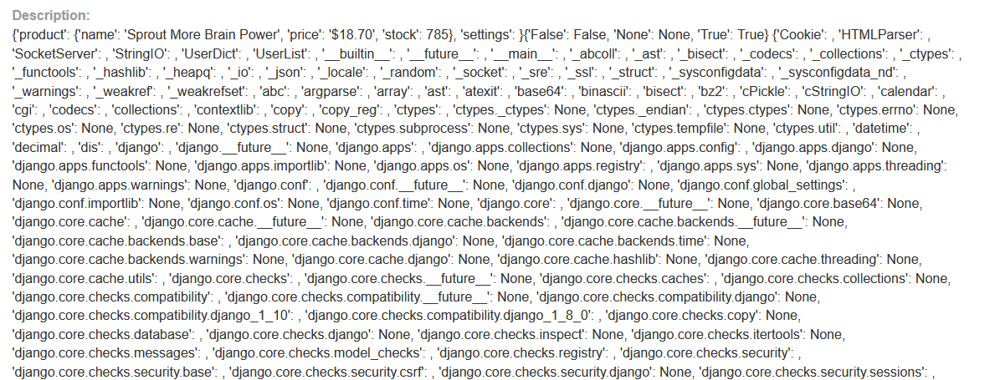
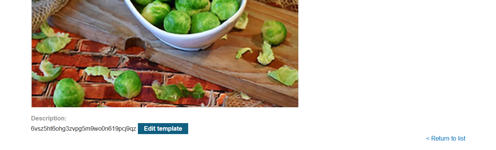
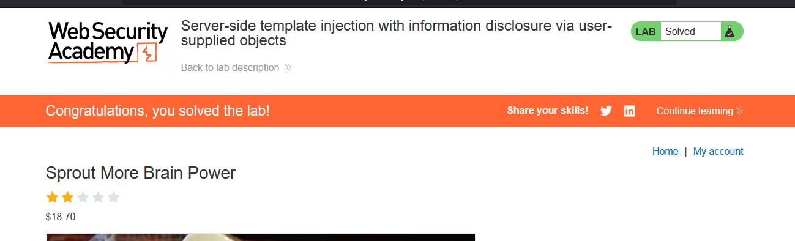

# Lab: Server-side template injection with information disclosure via user-supplied objects

> Lab Objective: steal and submit the framework's secret key.

- Login using provided credentials `content-manager:C0nt3ntM4n4g3r`

- View any product, then when editing template add `{{7*7}}` payload, that will cause an error indicating that Django template is being used.
  

- Use `` as a payload to view debug information
  

- You'll notice that you have access to settings object.

- To access App's Secret Key use this payload `{{ settings.SECRET_KEY }}`
  

- Submit the secret key and the lab is solved.
  

---
