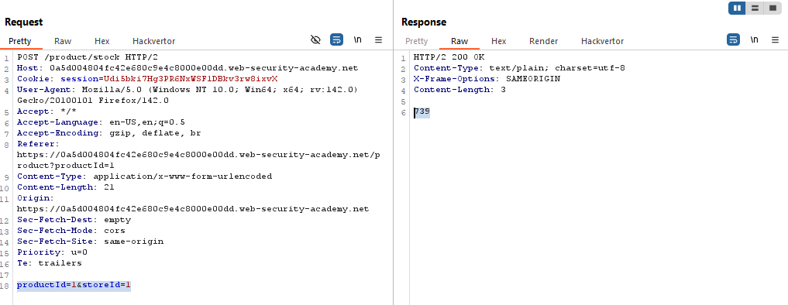
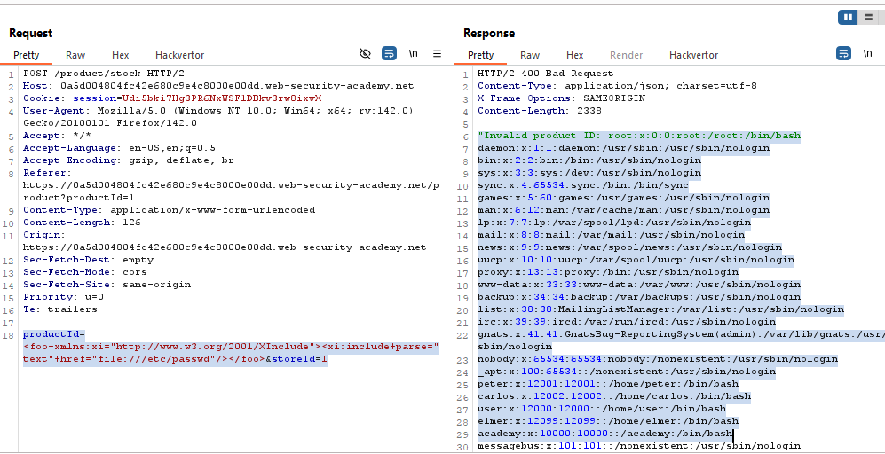

# Lab: Exploiting XInclude to retrieve files

> Lab Objective: inject an XInclude statement to retrieve the contents of the `/etc/passwd` file.

- Check Stock for any product, then inspect the request.

- You'll notice that the POST Data is not sent in XML Format/
  

- Therefore I'll try to exploit XInclude via this payload:

```xml
<foo xmlns:xi="http://www.w3.org/2001/XInclude">
<xi:include parse="text" href="file:///etc/passwd"/>
</foo>
```

- The `/etc/passwd` contents are retrieved:
  

- And The Lab is solved successfully.
  

---
